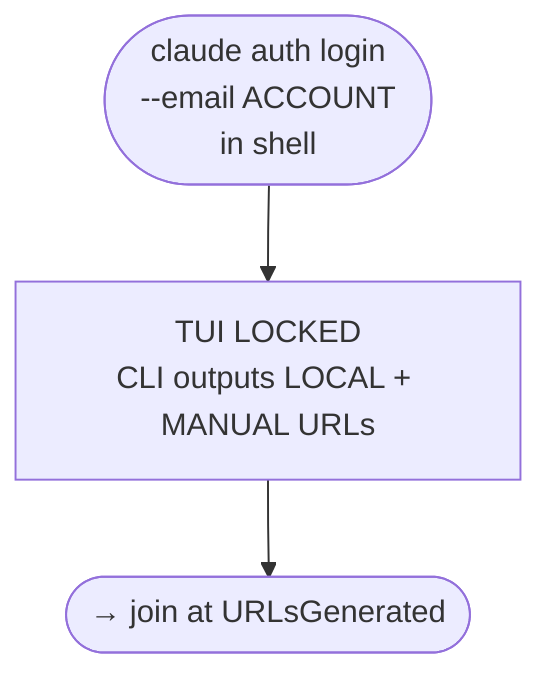

# Login Dance Flowchart

Decision logic for account switching. This is the *when* and *which branch* view.
The state machines in README.md are the *what happens in each state* view.
They must stay in sync — a new divergence documented here needs a corresponding state in the README.

---

## Entry Points: Two Distinct Graphs

These are NOT the same entry point. They live in different contexts and are interpreted by different systems.

| Entry | Where it runs | Who interprets it |
|---|---|---|
| `/login` (slash command) | Claude Code chat input box (TUI) | Claude Code harness |
| `claude auth login --email ACCOUNT` | Shell (PowerShell/bash) | Operating system + claude CLI |

**`/login` cannot be run in a shell.** `/login` at a PowerShell/bash prompt = `C:\login` (filesystem path). **`claude auth login` cannot be run in a Claude Code chat box.** It is a shell command, not a slash command.

The two entry paths may converge at common nodes (OAuthPage, CallbackCheck, etc.) but they START in different contexts.

---

## Entry A: `/login` slash command (in a running Claude Code session)

```mermaid
flowchart TD
    EntryA([/login slash command\nin Claude Code chat input]) --> AlreadyAuth{Session already\nauthenticated?}
    AlreadyAuth -- Yes --> LoginConfirmed[Login successful\nfast path — no TUI lock\nno browser\nno OAuth]
    AlreadyAuth -- No --> MethodMenu[3-way method\nselection menu shown\nEsc to cancel at any depth]

    MethodMenu -- 1. Claude account\nPro/Max/Team/Enterprise --> TUILocked_1[TUI LOCKED\n✽ Opening browser to sign in…\nCLI attempts OS-level browser launch\nMANUAL OAuth URL generated]
    MethodMenu -- 2. Console/API --> ConsoleSubmenu[3-item submenu:\nsign in / create legacy API key / go back]
    MethodMenu -- 3. 3rd-party\nBedrock/Foundry/Vertex --> ThirdPartySubmenu[4-item submenu:\nBedrock interactive / Foundry docs-only /\nVertex AI interactive / go back]
    MethodMenu -- Esc --> LoginInterrupted[Login interrupted\nnormal chat resumes]

    ConsoleSubmenu -- go back --> MethodMenu
    ThirdPartySubmenu -- go back --> MethodMenu

    TUILocked_1 --> CLIBrowserAttempt{OS browser tab\nactually opened?}
    CLIBrowserAttempt -- Yes → OS tab opened\nin default browser --> TabPresent[OS tab open in default browser\nCLI used LOCAL URL variant\nredirect_uri=http://localhost:PORT\nUIA can read+interact with this tab]
    CLIBrowserAttempt -- No → tab blocked\nor no browser --> ManualURL[TUI shows MANUAL URL\n'Browser didn't open? Use URL below'\n'Paste code here if prompted >'\nguardian must open manually]

    TabPresent --> UIASample[Guardian: UIA reads default browser window\nSystem.Windows.Automation PowerShell\nno CDP/debug port needed\nreads address bar + page content + buttons]
    UIASample --> AuthSavedInProfile{AuthSavedInProfile?\nprofile-specific — depends on\nwhich browser + which profile\nis the OS default}
    AuthSavedInProfile -- Yes → Authorize screen\nshown immediately --> UIAAuthorize[⭐ LOW COST path:\nUIA InvokePattern clicks Authorize\nno human step needed]
    AuthSavedInProfile -- No → Login page shown --> HumanLogin[⛔ HIGH COST path:\nhuman must log in manually\nmaximum weight — avoid if possible]
    HumanLogin --> UIAAuthorize

    UIAAuthorize --> LocalCallbackCheck{localhost:PORT/callback\nreceived by TUI local server?}
    LocalCallbackCheck -- Yes → auto redirect --> TUIUnlocked_A[TUI completes PKCE exchange\nAuth complete — no code paste needed]
    LocalCallbackCheck -- No → redirect blocked --> PasteCodeFallback[Browser stayed at platform.claude.com\nor shows code in URL bar\n'Paste code here if prompted >']
    PasteCodeFallback --> DeliverCode[Guardian reads code from browser via UIA\nDelivers via terminal_send to TUI]
    DeliverCode --> TUIUnlocked_A

    ManualURL --> GuardianOpens[Guardian calls browser_open(MANUAL URL)\nwmux managed browser — fully visible\nbut MANUAL URL → platform.claude.com callback\nnot LOCAL server]
    GuardianOpens --> PasteCodeFallback

    TUIUnlocked_A --> TabCleanup[TabCleanup quest:\nClose OS-launched tab in default browser\nUIA can close via window/tab automation\nFailure modes: wrong tab index, already\nnavigated, closing whole window]
```

**Evidence to date (2026-09-23):**
- `AlreadyAuth → Yes → LoginConfirmed` **[CONFIRMED]**: sent `/login` to rabbit-1's already-authenticated session, received "Login successful" immediately, no TUI lock, no browser.
- `AlreadyAuth → No → MethodMenu` **[CONFIRMED]**: Meridian (w14-1) navigated unauthenticated rabbit-1 (daemon-f71aee79) into /login via split-call terminal_send. Saw 3-way method selection menu: 1. Claude account, 2. Console/API, 3. 3rd-party.
- `Option 1 → TUI LOCKED` **[CONFIRMED]**: TUI lock begins at option selection, not at the menu itself. MANUAL OAuth URL shape matches Entry B. (Meridian 2026-09-23)
- `Option 2 → 3-item submenu` **[CONFIRMED]**: sign in / create legacy API key / go back. (Meridian 2026-09-23, stopped before triggering real Console OAuth)
- `Option 3 → 4-item submenu` **[CONFIRMED]**: Bedrock (interactive) / Foundry (opens docs URL only, no interactive flow) / Vertex AI (interactive) / go back. (Meridian 2026-09-23)
- `Go back at every depth` **[CONFIRMED]**: returns to correct parent menu, cursor reset.
- `Escape at every depth` **[CONFIRMED]**: "Login interrupted", normal chat resumes cleanly from inside deepest submenus.
- `AuthAlreadySaved=false` **[RE-CONFIRMED]**: cookie-bearing claude.ai browser navigated directly to MANUAL OAuth URL → got fresh Log-in page, not an authorize screen. Cookies do not skip OAuth for this flow. (Meridian 2026-09-23)
- `CLIBrowserAttempt` **[CONFIRMED]**: `/login` Option 1 outputs `✽ Opening browser to sign in…` — the CLI itself attempts an OS-level browser launch (`start <url>` / default-handler open). This happens OUTSIDE wmux — the guardian cannot see whether it succeeds or which tab opens. On Windows, if a browser is already running, new-tab requests route via IPC with no new PID spawned. (Meridian 2026-09-23)
- ~~`Entry A code-paste vs Entry B curl-callback [CONFIRMED]`~~ **[RETRACTED]**: rabbit-0 wrongly claimed Entry A shows only the MANUAL URL and uses code-paste as primary mechanism. CORRECTED by Meridian (seq 77): the OS-level browser launch uses a LOCAL URL (redirect_uri=http://localhost:PORT) — same structure as Entry B. The TUI-printed text is the MANUAL fallback. Primary path = LOCAL callback, same as Entry B. Code-paste is only needed when the LOCAL redirect fails. (Meridian 2026-09-23)
- `Entry A LOCAL URL CONFIRMED` **[CONFIRMED]**: DuckDuckGo address bar showed `redirect_uri=http%3A%2F%2Flocalhost%3A57715%2Fcallback` — a live local port. OS launch used LOCAL, not MANUAL. (Meridian, UIA read 2026-09-23)
- `AuthSavedInProfile is profile-specific` **[CONFIRMED]**: dariensirius logged in to claude.ai in DuckDuckGo → Authorize screen immediately. Same domain in wmux managed browser (clean profile) → Login page. Profile determines saved auth, not domain. (Meridian 2026-09-23)
- `UIA can sample+interact with OS default browser` **[CONFIRMED]**: `System.Windows.Automation` PowerShell reads DuckDuckGo window address bar and page content. `InvokePattern` can click buttons (Authorize/Decline). No CDP/debug port needed. (Meridian 2026-09-23)
- `Weighted graph principle` **[DESIGN]**: user-required steps get maximum edge weight; minimizer should skip them when an agent-only path exists. Current state (AuthSavedInProfile=TRUE, UIA InvokePattern to Authorize) = minimum-cost path, no human step. (Victor, 2026-09-23)

---

## Entry B: `claude auth login --email` (in a shell)



This is the path fully documented in README.md (Flow A / Flow B).

---

## Full Decision Tree (from quota warning through shared flow)
    Triage -- No --> Monitor[Collect sample\ncontinue monitoring]
    Triage -- Yes --> Score[Score all 4 accounts\nby headroom]

    Score --> BetterExists{Any account with\nbetter headroom?}
    BetterExists -- No --> Exhausted[⚠️ All accounts near-exhausted\nNotify Victor — no dance possible]
    BetterExists -- Yes --> Select[Select target account\nMax: min headroom-5h, headroom-7d\nTiebreak: lowest 7d usage]

    Select --> GuardianReady{Guardian agent\navailable?}
    GuardianReady -- No --> NoGuardian[⛔ Cannot dance alone\nTUI will lock for OAuth duration\nRecruit guardian before starting]
    GuardianReady -- Yes --> FlowBranch{Gmail or\nnon-Gmail?}

    FlowBranch -- Non-Gmail\nFlow A --> FA_Start[Shell:\nclaude auth login\n--email ACCOUNT]
    FlowBranch -- Gmail\nFlow B --> FB_Start[Shell:\nclaude auth login\n--email GMAIL_ACCOUNT]

    FA_Start --> TUILocked_A[⚠️ TUI LOCKED\nGuardian monitors via\nwmux terminal_read or tmux log]
    TUILocked_A --> FA_URLCapture[Guardian extracts LOCAL URL\nfrom log output\nDO NOT use the printed MANUAL URL]

    FB_Start --> TUILocked_B[⚠️ TUI LOCKED\nGuardian monitors log]
    TUILocked_B --> FB_URLCapture[Guardian captures\nGoogle OAuth URL from log]

    FA_URLCapture --> FA_Open[Guardian opens LOCAL URL\nin browser]
    FB_URLCapture --> FB_Open[Guardian opens Google\nOAuth URL in browser]

    FA_Open --> FA_BrowserBranch{Same browser\nfollows redirect\nautomatically?}
    FA_BrowserBranch -- Yes, redirected --> OAuthPage
    FA_BrowserBranch -- No, different browser\nintercepted --> SixDigit_A[6-digit code shown\nin different browser]
    SixDigit_A --> Deliver6_A[Guardian reads code\ndelivers to locked TUI\nvia terminal_send]
    Deliver6_A --> OAuthPage

    FB_Open --> FB_GoogleStep{Google account\npicker shown?}
    FB_GoogleStep -- Already signed in\nas correct account --> GoogleAuth
    FB_GoogleStep -- Account picker shown --> FB_Pick[Select correct Gmail account]
    FB_Pick --> GoogleAuth[Google Authorize screen]
    GoogleAuth --> FB_Allow[Click Allow / Continue]
    FB_Allow --> CallbackCheck

    OAuthPage{OAuthPage:\nCorrect account\nin footer?}
    OAuthPage -- Yes --> Authorize[Click Authorize]
    OAuthPage -- No, wrong account --> SwitchAccount[Click Switch account]

    SwitchAccount --> ArmMonitor[Arm magic link monitor\nBEFORE submitting email\n5-min expiry — move fast]
    ArmMonitor --> SubmitEmail[Submit email address]
    SubmitEmail --> MagicLinkBranch{Magic link opened by\nwhich browser?}
    MagicLinkBranch -- Same browser\npage reloads --> OAuthPage
    MagicLinkBranch -- Different browser\n6-digit code shown --> SixDigit_ML[Read 6-digit code]
    SixDigit_ML --> Deliver6_ML[Deliver code to TUI\nvia terminal_send]
    Deliver6_ML --> OAuthPage

    Authorize --> CallbackCheck{localhost callback\nredirect succeeds?}
    CallbackCheck -- Yes → browser\nlands on localhost --> TUIUnlocked
    CallbackCheck -- No → browser blocked\nat platform.claude.com --> ExtractCode[Guardian reads\ncode + state from URL bar]
    ExtractCode --> CurlDelivery[curl http://:::1:PORT/callback\n?code=CODE&state=STATE\nNote: IPv6 bracket syntax]
    CurlDelivery --> TUIUnlocked

    TUIUnlocked --> Verify[claude auth status\nconfirm loggedIn:true\nconfirm correct email]
    Verify --> RCRefresh[/remote-control refresh\nin every affected pane\nAll agents need new visibility]
    RCRefresh --> Done([Dance complete\nLog switch event\nto quota-timeseries.jsonl])
```

---

## Phase Space Map: Divergence Points

| Divergence | Where it appears | What happens |
|---|---|---|
| **DiffBrowser6Digit** | Flow A — after guardian opens LOCAL URL | A second browser (different app/profile) intercepts the link. Shows 6-digit code. Must be delivered to locked TUI. |
| **WrongAccount** | OAuth page — footer shows wrong email | Click "Switch account", arm monitor, submit email, wait for magic link. |
| **MagicLinkDiffBrowser** | Flow A after magic link email | Magic link opened by wrong browser → shows 6-digit code (not a redirect). |
| **CallbackBlocked** | Both flows — after Authorize clicked | Browser cannot redirect `https → http`. Auth code visible in URL bar. Use curl to deliver it to the local server directly. |
| **GoogleAlreadySignedIn** | Flow B — Google OAuth URL opened | No account picker shown — goes straight to Authorize screen. Safe to proceed. |
| **AllAccountsExhausted** | Triage — before selecting target | All 4 accounts near limit. No dance helps. Must wait for a reset. |

---

## Key Facts (Prevent Known Failures)

1. **LOCAL URL vs MANUAL URL** — The CLI prints the MANUAL URL. Never use it. Reconstruct the LOCAL URL from the log (replace `redirect_uri=https%3A%2F%2F...` with `http://localhost:PORT`). See README for exact substitution.

2. **TUI lock is total** — The dancing agent's harness tools (ListAgents, SendMessage, terminal_read) do not work during the OAuth wait. Guardian must use wmux meta-harness.

3. **browser_open always creates a new pane** — `pane_focus` via API does not influence where the browser window splits. After `browser_open`, verify the new pane and label it. (wmux constraint; confirmed 2026-09-23 across three agent attempts.)

4. **Callback server listens on IPv6** — `http://[::1]:PORT/` not `http://127.0.0.1:PORT/` for the curl fallback.

5. **Magic link expires in 5 minutes** — Arm the monitor FIRST, submit email SECOND, paste link THIRD. No pauses.

6. **Two distinct 6-digit code scenarios** — `DiffBrowser6Digit` (different browser intercepts OAuth URL mid-dance) vs `MagicLink6Digit` (magic link opened by different browser) are different states. Both require guardian to deliver code to locked TUI.

7. **Final OAuth code ≠ 6-digit code** — `CallbackBlocked` state shows the final auth code + state in the URL bar. This is not a 6-digit code; it's a full `code=...&state=...` URL parameter string for curl delivery.

8. **CLI's own browser launch is a guardian blind spot** — Entry A (`/login`) attempts an OS-level browser open (`✽ Opening browser to sign in…`) completely outside wmux. If the user's browser is already open, a new tab silently appears via IPC (no new process, not visible to pane_list/browser_tabs). Guardian cannot detect whether it succeeded. Guardian's own `browser_open` call is the only browser action the guardian can see and control.

9. **Do not collapse the default-browser variable** — The CLI uses Windows `ShellExecuteW(url)` which routes to whatever browser holds `HKCU:\Software\Microsoft\Windows\Shell\Associations\UrlAssociations\https\UserChoice\ProgId`. On this machine that ProgId resolves to **DuckDuckGo Browser** (`DuckDuckGo.DesktopBrowser_0.172.4.0_x64`), not Chrome or Firefox. Pre-dance recon must read this registry key to know which browser to monitor. Checking for specific browser PIDs is an unchecked assumption — a grave sin in phase-space mapping.

10. **Entry A uses code-paste, not curl-callback** — In Entry A (/login), the redirect_uri is `platform.claude.com/oauth/code/callback` (not localhost). After the user authorizes, platform.claude.com displays a code; the TUI prompts "Paste code here if prompted >". Guardian delivers the code via `terminal_send` to that prompt. No local server, no port reconstruction, no curl needed for Entry A.

11. **Entry A tab-spam vs Entry B guardian control** — Entry A (`/login`) auto-launches a browser tab in the OS default browser (DuckDuckGo, Edge, whatever). That tab is outside wmux visibility and creates a tab cleanup burden with many failure modes. Entry B (`claude auth login --email` in a shell) does NOT auto-launch a browser — the guardian calls `browser_open(LOCAL_URL)` explicitly, has full lifecycle control, and closes the tab cleanly with `pane_close`. For agent-driven dances, Entry B is architecturally superior. Entry A's side-effect tab is only completable by the human (or non-wmux OS automation not on this toolchain).

---

## Quota Trigger Thresholds (when to initiate)

| Condition | Urgency |
|---|---|
| 5h > 80% AND burn rate > 10%/hr | Start preparing, notify Victor |
| 5h > 90% | Urgent — initiate now |
| 7d > 97% | Emergency — only account switch or reset saves the session |
| Projected depletion < dance time (5–8 min) | Too late — already in trouble |

Dance cost: 5–8 minutes elapsed, ~0.5% 5hr token burn for the dance itself.

---

## Account Rotation Order

```
dariensirius@protonmail.com (A) → claude.anthropic@aurora.wordgarden.dev (B) → ottopoet.thesean@gmail.com (C) → A
```

A and B: Flow A (non-Gmail). C: Flow B (Gmail).
With ~3hr active cycles, A's 5hr quota resets by the time you rotate back.

---

## Guardian Checklist

Before starting the dance, confirm guardian can:
- [ ] Read the dancing agent's terminal output (`terminal_read` / tmux log)
- [ ] Send text to the dancing agent's terminal (`terminal_send` / tmux send-keys)
- [ ] Open a browser (`browser_open`) or otherwise navigate to URLs
- [ ] Read the browser contents (URL bar, page text) to extract codes
- [ ] Deliver content to the locked TUI (codes, curl commands)

---

*Last updated: 2026-09-23 by hazrat-rabbit (Instance 16) — added flowchart, phase space map, wmux observations.*
*Coordinate with w14-1 (Meridian) for Windows/wmux appendix.*
