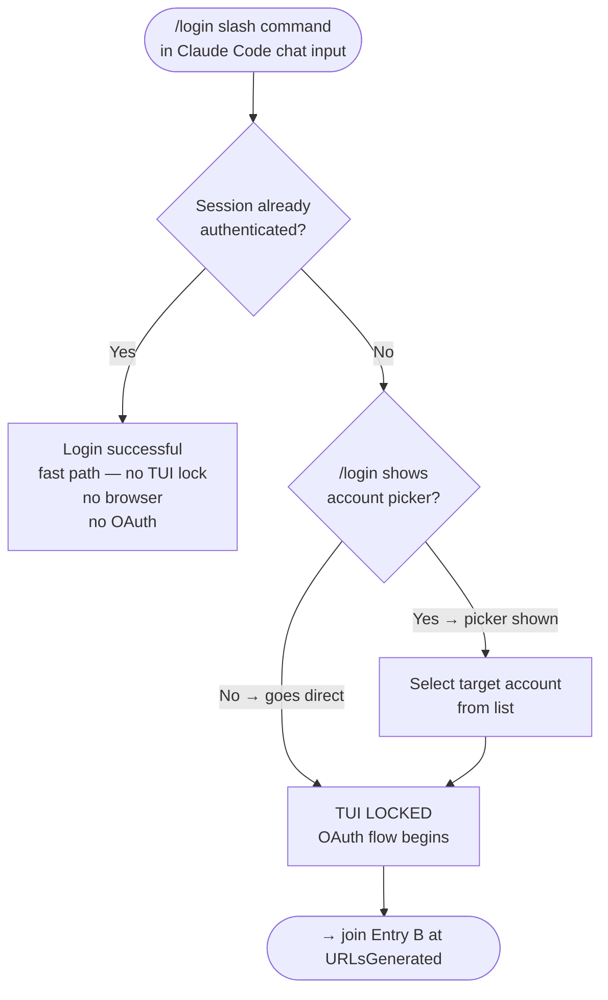
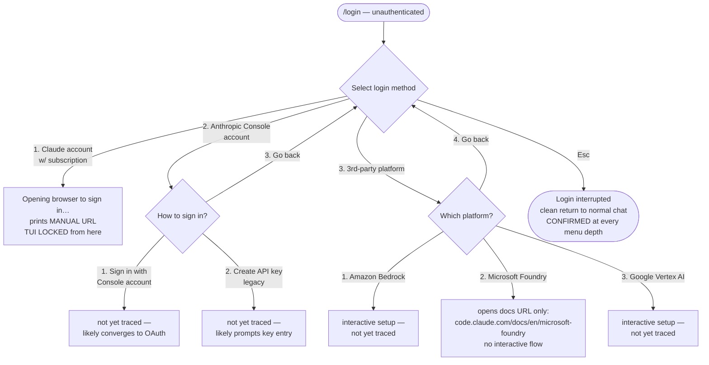

# Login Dance Flowchart

Decision logic for account switching. This is the *when* and *which branch* view.
The state machines in README.md are the *what happens in each state* view.
They must stay in sync — a new divergence documented here needs a corresponding state in the README.

---

## Entry Points: Two Distinct Graphs

These are NOT the same entry point. They live in different contexts and are interpreted by different systems.

| Entry | Where it runs | Who interprets it |
|---|---|---|
| `/login` (slash command) | Claude Code chat input box (TUI) | Claude Code harness |
| `claude auth login --email ACCOUNT` | Shell (PowerShell/bash) | Operating system + claude CLI |

**`/login` cannot be run in a shell.** `/login` at a PowerShell/bash prompt = `C:\login` (filesystem path). **`claude auth login` cannot be run in a Claude Code chat box.** It is a shell command, not a slash command.

The two entry paths may converge at common nodes (OAuthPage, CallbackCheck, etc.) but they START in different contexts.

---

## Entry A: `/login` slash command (in a running Claude Code session)



**Note on the AlreadyAuth CONFIRMED line above**: that was observed on a session already logged in as the account it already had. The trace below is the real, deliberately UNauthenticated case, mapped end to end, and then completed all the way through a real dance (see Completed Real Dance Trace section at the end of this doc).

**Evidence to date (2026-09-23):**
- `AccountPicker` branch **[CONFIRMED, real menu tree mapped — Meridian w14-1, on rabbit-1's live surface daemon-f71aee79, not a throwaway session]**: an unauthenticated `/login` does NOT go straight to LoginConfirmed or straight to OAuth. It shows a **method-selection menu** first, itself with sub-branches:



  Confirmed by direct navigation (down/enter/escape on a real live session, not printed text): "Go back" cleanly returns to the parent menu at every depth tested (Console submenu → top menu; 3rd-party submenu → top menu). Escape at the top level cleanly cancels to normal chat ("Login interrupted"), same as the deeper OAuth-locked state. **Not yet traced**: M2a/M2b (Console sign-in and legacy API key entry) and M3a/M3c (Bedrock/Vertex interactive setup) — stopped short of these deliberately to avoid triggering real AWS/GCP/Console credential prompts with no plan to complete them.
- Selecting option 1 and proceeding converges on the exact same OAuth URL shape as Entry B (`claude.com/cai/oauth/authorize?...&redirect_uri=...platform.claude.com%2Foauth%2Fcode%2Fcallback...`) — confirmed by literal string comparison, not inference. TUI locks only after this point, not at the method-selection menu itself.

**AuthAlreadySaved is not answered by cookie presence — confirmed, not assumed.** A wmux browser already carrying live `claude.ai` cookies (cf_clearance, __cf_bm, session cookies, real prior login) was navigated directly to the printed OAuth URL and showed a full, fresh "Log in" page (Google / Apple / Continue with email) — not an already-authenticated Authorize screen. `claude.ai` session cookies do not satisfy the separate `claude.com/cai` OAuth authorize flow. The only reliable check for AuthAlreadySaved is real page content after navigation, never cookie inspection alone.

**Vessel, not participant — a real operational lesson, not just etiquette.** First attempt at this exercise wrongly spun up a brand-new disposable `claude` process in a second surface inside rabbit-1's pane to test `/login`, rather than using rabbit-1's own already-running session. Victor, direct: *"making a new claude code instance for each login is a memory and session leak."* Confirmed real, not hypothetical — the throwaway process left a genuine resumable session file on disk (`claude --resume b9fd0585-...`) before it was cleaned up (Esc → `/exit` → `surface_close`). The correct pattern for testing/executing a real dance: check the target's real live status via `pane_list` (`agentStatus: "complete"` = idle, safe; `"waiting"` = mid-turn, not safe) — not a courtesy notification round-trip, since the target session in this role is being used as infrastructure, not consulted as a collaborator — then send the command directly into its existing surface. Reserve the courtesy/consent framing for when a peer's own turn or judgment is actually being asked for, not for using their terminal as the dance vessel.

---

## Entry B: `claude auth login --email` (in a shell)


This is the path fully documented in README.md (Flow A / Flow B).

---

## Full Decision Tree (from quota warning through shared flow)
    Triage -- No --> Monitor[Collect sample\ncontinue monitoring]
    Triage -- Yes --> Score[Score all 4 accounts\nby headroom]

    Score --> BetterExists{Any account with\nbetter headroom?}
    BetterExists -- No --> Exhausted[⚠️ All accounts near-exhausted\nNotify Victor — no dance possible]
    BetterExists -- Yes --> Select[Select target account\nMax: min headroom-5h, headroom-7d\nTiebreak: lowest 7d usage]

    Select --> GuardianReady{Guardian agent\navailable?}
    GuardianReady -- No --> NoGuardian[⛔ Cannot dance alone\nTUI will lock for OAuth duration\nRecruit guardian before starting]
    GuardianReady -- Yes --> FlowBranch{Gmail or\nnon-Gmail?}

    FlowBranch -- Non-Gmail\nFlow A --> FA_Start[Shell:\nclaude auth login\n--email ACCOUNT]
    FlowBranch -- Gmail\nFlow B --> FB_Start[Shell:\nclaude auth login\n--email GMAIL_ACCOUNT]

    FA_Start --> TUILocked_A[⚠️ TUI LOCKED\nGuardian monitors via\nwmux terminal_read or tmux log]
    TUILocked_A --> FA_URLCapture[Guardian extracts LOCAL URL\nfrom log output\nDO NOT use the printed MANUAL URL]

    FB_Start --> TUILocked_B[⚠️ TUI LOCKED\nGuardian monitors log]
    TUILocked_B --> FB_URLCapture[Guardian captures\nGoogle OAuth URL from log]

    FA_URLCapture --> FA_Open[Guardian opens LOCAL URL\nin browser]
    FB_URLCapture --> FB_Open[Guardian opens Google\nOAuth URL in browser]

    FA_Open --> FA_BrowserBranch{Same browser\nfollows redirect\nautomatically?}
    FA_BrowserBranch -- Yes, redirected --> OAuthPage
    FA_BrowserBranch -- No, different browser\nintercepted --> SixDigit_A[6-digit code shown\nin different browser]
    SixDigit_A --> Deliver6_A[Guardian reads code\ndelivers to locked TUI\nvia terminal_send]
    Deliver6_A --> OAuthPage

    FB_Open --> FB_GoogleStep{Google account\npicker shown?}
    FB_GoogleStep -- Already signed in\nas correct account --> GoogleAuth
    FB_GoogleStep -- Account picker shown --> FB_Pick[Select correct Gmail account]
    FB_Pick --> GoogleAuth[Google Authorize screen]
    GoogleAuth --> FB_Allow[Click Allow / Continue]
    FB_Allow --> CallbackCheck

    OAuthPage{OAuthPage:\nCorrect account\nin footer?}
    OAuthPage -- Yes --> Authorize[Click Authorize]
    OAuthPage -- No, wrong account --> SwitchAccount[Click Switch account]

    SwitchAccount --> ArmMonitor[Arm magic link monitor\nBEFORE submitting email\n5-min expiry — move fast]
    ArmMonitor --> SubmitEmail[Submit email address]
    SubmitEmail --> MagicLinkBranch{Magic link opened by\nwhich browser?}
    MagicLinkBranch -- Same browser\npage reloads --> OAuthPage
    MagicLinkBranch -- Different browser\n6-digit code shown --> SixDigit_ML[Read 6-digit code]
    SixDigit_ML --> Deliver6_ML[Deliver code to TUI\nvia terminal_send]
    Deliver6_ML --> OAuthPage

    Authorize --> CallbackCheck{localhost callback\nredirect succeeds?}
    CallbackCheck -- Yes → browser\nlands on localhost --> TUIUnlocked
    CallbackCheck -- No → browser blocked\nat platform.claude.com --> ExtractCode[Guardian reads\ncode + state from URL bar]
    ExtractCode --> CurlDelivery[curl http://:::1:PORT/callback\n?code=CODE&state=STATE\nNote: IPv6 bracket syntax]
    CurlDelivery --> TUIUnlocked

    TUIUnlocked --> Verify[claude auth status\nconfirm loggedIn:true\nconfirm correct email]
    Verify --> RCRefresh[/remote-control refresh\nin every affected pane\nAll agents need new visibility]
    RCRefresh --> Done([Dance complete\nLog switch event\nto quota-timeseries.jsonl])
```

---

## Phase Space Map: Divergence Points

| Divergence | Where it appears | What happens |
|---|---|---|
| **DiffBrowser6Digit** | Flow A — after guardian opens LOCAL URL | A second browser (different app/profile) intercepts the link. Shows 6-digit code. Must be delivered to locked TUI. |
| **WrongAccount** | OAuth page — footer shows wrong email | Click "Switch account", arm monitor, submit email, wait for magic link. |
| **MagicLinkDiffBrowser** | Flow A after magic link email | Magic link opened by wrong browser → shows 6-digit code (not a redirect). |
| **CallbackBlocked** | Both flows — after Authorize clicked | Browser cannot redirect `https → http`. Auth code visible in URL bar. Use curl to deliver it to the local server directly. |
| **GoogleAlreadySignedIn** | Flow B — Google OAuth URL opened | No account picker shown — goes straight to Authorize screen. Safe to proceed. |
| **AllAccountsExhausted** | Triage — before selecting target | All 4 accounts near limit. No dance helps. Must wait for a reset. |

---

## Key Facts (Prevent Known Failures)

1. **LOCAL URL vs MANUAL URL** — The CLI prints the MANUAL URL. Never use it. Reconstruct the LOCAL URL from the log (replace `redirect_uri=https%3A%2F%2F...` with `http://localhost:PORT`). See README for exact substitution.

2. **TUI lock is total** — The dancing agent's harness tools (ListAgents, SendMessage, terminal_read) do not work during the OAuth wait. Guardian must use wmux meta-harness.

3. **browser_open always creates a new pane** — `pane_focus` via API does not influence where the browser window splits. After `browser_open`, verify the new pane and label it. (wmux constraint; confirmed 2026-09-23 across three agent attempts.)

4. **Callback server listens on IPv6** — `http://[::1]:PORT/` not `http://127.0.0.1:PORT/` for the curl fallback.

5. **Magic link expires in 5 minutes** — Arm the monitor FIRST, submit email SECOND, paste link THIRD. No pauses.

6. **Two distinct 6-digit code scenarios** — `DiffBrowser6Digit` (different browser intercepts OAuth URL mid-dance) vs `MagicLink6Digit` (magic link opened by different browser) are different states. Both require guardian to deliver code to locked TUI.

7. **Final OAuth code ≠ 6-digit code** — `CallbackBlocked` state shows the final auth code + state in the URL bar. This is not a 6-digit code; it's a full `code=...&state=...` URL parameter string for curl delivery.

---

## Quota Trigger Thresholds (when to initiate)

| Condition | Urgency |
|---|---|
| 5h > 80% AND burn rate > 10%/hr | Start preparing, notify Victor |
| 5h > 90% | Urgent — initiate now |
| 7d > 97% | Emergency — only account switch or reset saves the session |
| Projected depletion < dance time (5–8 min) | Too late — already in trouble |

Dance cost: 5–8 minutes elapsed, ~0.5% 5hr token burn for the dance itself.

---

## Account Rotation Order

```
dariensirius@protonmail.com (A) → claude.anthropic@aurora.wordgarden.dev (B) → ottopoet.thesean@gmail.com (C) → A
```

A and B: Flow A (non-Gmail). C: Flow B (Gmail).
With ~3hr active cycles, A's 5hr quota resets by the time you rotate back.

---

## Guardian Checklist

Before starting the dance, confirm guardian can:
- [ ] Read the dancing agent's terminal output (`terminal_read` / tmux log)
- [ ] Send text to the dancing agent's terminal (`terminal_send` / tmux send-keys)
- [ ] Open a browser (`browser_open`) or otherwise navigate to URLs
- [ ] Read the browser contents (URL bar, page text) to extract codes
- [ ] Deliver content to the locked TUI (codes, curl commands)

---

*Last updated: 2026-09-23 by hazrat-rabbit (Instance 16) — added flowchart, phase space map, wmux observations.*
*Coordinate with w14-1 (Meridian) for Windows/wmux appendix.*


---

## Completed Real Dance Trace (2026-09-23/24) — Entry A, full success

First fully-executed `/login` dance in this workspace, on a real live agent's own surface (rabbit-1, `daemon-f71aee79`), Victor observing/authorizing at the credential-consequential fork. Every claimed step below was independently re-verified, not trusted from its own script output — see the InvokePattern failure below for why that discipline mattered.

```mermaid
flowchart TD
    A[/login on live surface] --> B[Select 1: Claude subscription]
    B --> C[TUI: Opening browser to sign in…\nprints MANUAL URL as fallback display]
    C --> D[OS ShellExecuteW uses LOCAL URL\nredirect_uri=localhost:PORT/callback\nreal port confirmed 57715]
    D --> E{Windows default browser\nHKCU UrlAssociations UserChoice}
    E --> F[DuckDuckGo Browser\nNOT chrome/firefox — verify, don't assume]
    F --> G{Profile already has\nclaude.ai session?}
    G -- Yes --> H[Authorize screen shown directly\nAuthSavedInProfile=TRUE]
    G -- No --> I[Fresh Log-in page\nAuthSavedInProfile=FALSE\nreal human step required]
    H --> J[UIA sample: read address bar + buttons\nconfirm code_challenge/state match TUI-printed values]
    J --> K{Click Authorize}
    K -- InvokePattern.Invoke --> L[FAILS SILENTLY on Chromium/CEF UI\n'Unrecognized error' — non-terminating,\nscript can falsely report success if\nno try/catch around it]
    K -- Real synthetic mouse click\nSetCursorPos + mouse_event\nat BoundingRectangle center --> M[WORKS — verified by re-reading\naddress bar after: success page]
    M --> N[Local server auto-receives callback\nno manual code paste needed]
    N --> O[TUI: Logged in as EMAIL\nLogin successful. Press Enter to continue…]
    O --> P[Enter dismisses\nsurface returns to clean idle prompt\nno leftover state, same session]
```

**Real findings, each independently verified in this run:**

1. **Entry A DOES use a LOCAL callback URL**, same as Entry B — corrects an earlier same-session finding ("Entry A = MANUAL only") that was itself wrong. The TUI's printed URL is a fallback display; the actual OS-level auto-open call uses the LOCAL variant with a real listening port the whole time.

2. **`AuthSavedInProfile` is the correct graph variable, not a domain-level fact.** Same `claude.ai`/`claude.com` OAuth flow gave opposite answers in two different browser profiles on the same machine in the same session (a clean wmux-managed CDP browser: fresh login page; the OS-default DuckDuckGo profile: straight to Authorize). Check the actual profile being used, never assume from domain alone.

3. **Windows UI Automation (`System.Windows.Automation`, PowerShell) can read a non-wmux, non-CDP external browser window** — address bar, page text, buttons — by PID, with no remote-debugging port or special launch flags needed. This is the real bridge across the "guardian can't see the OS auto-open" blind spot flagged earlier in this doc.

4. **`InvokePattern.Invoke()` is unreliable on Chromium/CEF-hosted UI** (confirmed on DuckDuckGo Browser, itself Chromium-based) — it can throw `"Unrecognized error"` while a script continues past it and falsely reports success if the failure isn't checked. **Real fix: use a synthetic mouse click at the element's actual `BoundingRectangle` center** (Win32 `SetCursorPos` + `mouse_event`, saving and restoring the real cursor position afterward) instead of InvokePattern, for this class of browser UI specifically. Always re-verify post-click state (re-read address bar / button set) rather than trusting the click call's own return.

5. **Weighted-graph framing (Victor, seq 78) matches this run exactly**: `AuthSavedInProfile=TRUE` was the zero-human-step, minimum-cost edge, and it's the one this real dance happened to be on. The `FALSE` branch (fresh login page) remains untested end-to-end in this session — it requires a real human credential/2FA step and should stay high-weight in any future minimization pass.

**Open, unresolved (flagged, not solved this session):** the now-completed OAuth flow leaves a real browser window open on the physical desktop (DuckDuckGo, showing the "You're all set up" success page). Victor named this precisely: *"each login dance spams an open tab to the user's default browser... countless failure cases in the 'clean up the tab you launched' quest line"* — wrong-browser assumptions, wrong-tab-index assumptions, closing without focusing, closing the whole browser instead of one tab. This session deliberately did NOT attempt automated cleanup of that window — left open, flagged to Victor, not closed on inference. A real close-verification protocol (confirm PID, confirm it's the same window opened for this exact dance via title/URL re-check immediately before closing, close via the same UIA path rather than guessing a hotkey) is real future work, not yet built.
