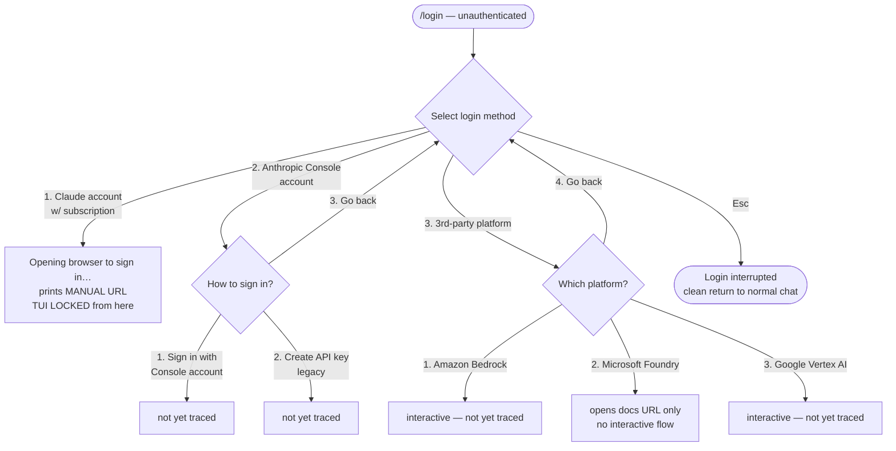
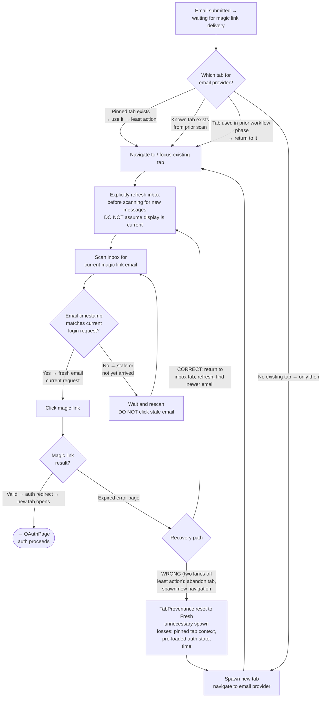
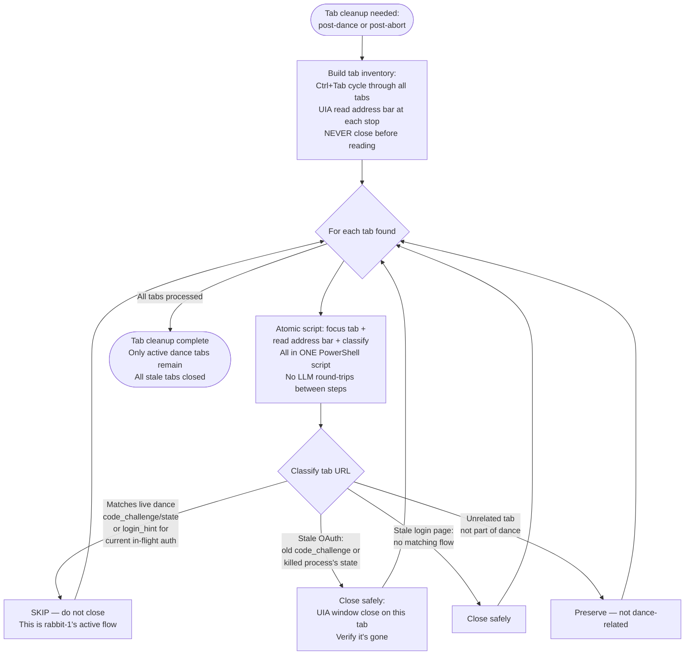

# Login Dance Flowchart

Decision logic for account switching. This is the *when* and *which branch* view.
The state machines in README.md are the *what happens in each state* view.
They must stay in sync — a new divergence documented here needs a corresponding state in the README.

---

## Reading this doc on a different platform or harness — graph vs. tooling

**The phase-space graph below (entry points, nodes, decision branches, failure modes) is
real and platform-independent.** Every specific mechanism cited alongside it
(`System.Windows.Automation`, `SetForegroundWindow`, `SendKeys`, Win32 coordinate clicks)
is **this session's own implementation on Windows 11 + PowerShell + a Chromium/CEF-based
default browser (DuckDuckGo Browser on this machine).** It is not a requirement of the
graph itself — it's one working answer to a question every node in the "browser
interaction" section is really asking. Do not read "UIA" as load-bearing; read the
underlying capability it's standing in for.

The recurring underlying capabilities, generalized:

| Generic capability | What Windows/UIA/wmux did here | What you'd likely use instead |
|---|---|---|
| Read the browser's current URL/page content | `System.Windows.Automation` (PowerShell), no CDP needed | Playwright/CDP `page.url()` + DOM read; macOS Accessibility API (`AXUIElement`); Linux AT-SPI; a browser extension content script; or a managed/sandboxed browser your harness already exposes (e.g. a built-in browser tool) |
| Click a specific button reliably | Win32 `SetCursorPos`+`mouse_event` at the element's `BoundingRectangle`, focus-verified before AND after (see Key Facts 23-24 — a naive `InvokePattern`/focus-once approach silently fails on Chromium/CEF) | Playwright/CDP's own `.click()` (generally reliable against Chromium without this fight, since it drives the page directly rather than fighting OS window focus); a browser tool's native click primitive |
| Detect whether your OS-level input actually landed | Re-read state after the action, compare before/after, never trust the action call's own return value | Same discipline applies universally — whatever mechanism you use, verify post-action state independently; this lesson (Key Facts 21, 23-24) is NOT Windows-specific |
| Enumerate all open tabs | **Not solved here** — DuckDuckGo/CEF exposes zero `TabItem` controls via UIA; the workaround was Ctrl+Tab/Ctrl+9 cycling with examine-before-acting, not true enumeration | A CDP/Playwright-driven browser can likely `browser.contexts()[].pages()` directly — if your platform can do real tab enumeration, that's strictly better than this session's workaround; please extend this doc with it |
| Read the dancer's terminal output | wmux `terminal_read` (PTY-targeted by `ptyId`) | tmux `pipe-pane`; SSH pty-read; `screen -X hardcopy`; your harness's own terminal-read primitive |
| Deliver keystrokes/text to a locked TUI | wmux `terminal_send`/`terminal_send_key`, PTY-targeted by `ptyId` | tmux `send-keys`; SSH write-to-pty; whatever your meta-harness's equivalent PTY-write primitive is |
| Enumerate live agent surfaces | wmux `pane_list` + `surface_list` | `ps aux \| grep claude`; procfs; launchctl on Mac; your harness's process registry |

**If you're extending this graph from a different platform**: keep the node names and
decision structure (they're the real, hard-won part — see the Completed Real Dance
Trace and the Key Facts for what was actually validated, not assumed), and add your own
tooling-mapping row/column rather than replacing the Windows-specific detail — future
readers on Windows still need it, and future readers on your platform need theirs
alongside it, not instead of it. A real, open gap worth flagging if you close it: full
tab enumeration (see table above) and a genuinely reliable click mechanism that doesn't
require OS-level foreground-focus fighting.

**Invitation for cross-platform contributors:** Add observations as new sections in this file or as `TRACES.<platform>.md`. Confirmed paths always beat theory — mark your evidence with `[CONFIRMED: platform/harness/date]`. Open a PR on `SKILL-OF/claude-code-account-login`, branch `skill/claude-code-account-login`.

---

## Entry Points: Two Distinct Graphs

These are NOT the same entry point. They live in different contexts and are interpreted by different systems.

| Entry | Where it runs | Who interprets it |
|---|---|---|
| `/login` (slash command) | Claude Code chat input box (TUI) | Claude Code harness |
| `claude auth login --email ACCOUNT` | Shell (PowerShell/bash) | Operating system + claude CLI |

**`/login` cannot be run in a shell.** `/login` at a PowerShell/bash prompt = `C:\login` (filesystem path). **`claude auth login` cannot be run in a Claude Code chat box.** It is a shell command, not a slash command.

The two entry paths may converge at common nodes (OAuthPage, CallbackCheck, etc.) but they START in different contexts.

---

## Entry A: `/login` slash command (in a running Claude Code session)

```mermaid
flowchart TD
    EntryA([/login slash command\nin Claude Code chat input]) --> AlreadyAuth{Session already\nauthenticated?}
    AlreadyAuth -- Yes --> LoginConfirmed[Login successful\nfast path — no TUI lock\nno browser\nno OAuth]
    AlreadyAuth -- No --> MethodMenu[3-way method\nselection menu shown\nEsc to cancel at any depth]

    MethodMenu -- 1. Claude account\nPro/Max/Team/Enterprise --> TUILocked_1[TUI LOCKED\n✽ Opening browser to sign in…\nCLI attempts OS-level browser launch\nMANUAL OAuth URL generated]
    MethodMenu -- 2. Console/API --> ConsoleSubmenu[3-item submenu:\nsign in / create legacy API key / go back]
    MethodMenu -- 3. 3rd-party\nBedrock/Foundry/Vertex --> ThirdPartySubmenu[4-item submenu:\nBedrock interactive / Foundry docs-only /\nVertex AI interactive / go back]
    MethodMenu -- Esc --> LoginInterrupted[Login interrupted\nnormal chat resumes]

    ConsoleSubmenu -- go back --> MethodMenu
    ThirdPartySubmenu -- go back --> MethodMenu

    TUILocked_1 --> CLIBrowserAttempt{OS browser tab\nactually opened?}
    CLIBrowserAttempt -- Yes → OS tab opened\nin default browser --> TabPresent[OS tab open in default browser\nCLI used LOCAL URL variant\nredirect_uri=http://localhost:PORT\nUIA can read+interact with this tab]
    CLIBrowserAttempt -- No → tab blocked\nor no browser --> ManualURL[TUI shows MANUAL URL\n'Browser didn't open? Use URL below'\n'Paste code here if prompted >'\nguardian must open manually]

    TabPresent --> UIASample[Guardian: UIA reads default browser window\nSystem.Windows.Automation PowerShell\nno CDP/debug port needed\nreads address bar + page content + buttons]
    UIASample --> BrowserAccountCheck{BrowserAccountCheck:\nUIA reads page footer / account indicator\nWhich account is this browser currently logged in as?}
    BrowserAccountCheck -- Browser logged in as TARGET account\n→ Authorize screen → CORRECT low-cost path --> UIAAuthorize[⭐ LOW COST path:\nWin32 coordinate click: SetForegroundWindow first\nthen SetCursorPos + mouse_event at BoundingRectangle center\nInvokePattern FAILS on Chromium/CEF — false positive\nno human step needed]
    BrowserAccountCheck -- Browser logged in as CURRENT (old) account\n→ Authorize screen → LOOPBACK TRAP --> LoopbackTrap[⚠️ LOOPBACK TRAP:\nBrowser is logged in as the account you are switching FROM\nAuthorizing here re-authenticates the old account\nMust switch browser identity before Authorize]
    BrowserAccountCheck -- No session → Login page shown --> HumanLogin[⛔ HIGH COST path:\nhuman must log in manually\nmaximum weight — avoid if possible]
    LoopbackTrap --> SwitchBrowserAccount[Switch browser account:\nsign out → sign in as TARGET\nor use account switcher if present]
    SwitchBrowserAccount --> BrowserAccountCheck
    HumanLogin --> UIAAuthorize

    UIAAuthorize --> LocalCallbackCheck{localhost:PORT/callback\nreceived by TUI local server?}
    LocalCallbackCheck -- Yes → auto redirect --> TUIUnlocked_A[TUI completes PKCE exchange\nAuth complete — no code paste needed]
    LocalCallbackCheck -- No → redirect blocked --> PasteCodeFallback[Browser stayed at platform.claude.com\nor shows code in URL bar\n'Paste code here if prompted >']
    PasteCodeFallback --> DeliverCode[Guardian reads code from browser via UIA\nDelivers via terminal_send to TUI]
    DeliverCode --> TUIUnlocked_A

    ManualURL --> GuardianOpens[Guardian calls browser_open(MANUAL URL)\nwmux managed browser — fully visible\nbut MANUAL URL → platform.claude.com callback\nnot LOCAL server]
    GuardianOpens --> PasteCodeFallback

    TUIUnlocked_A --> RCBlastRadius[⚡ MACHINE-WIDE blast-radius:\n~/.claude/.credentials.json updated globally\nEVERY running Claude Code agent on this machine\nsimultaneously receives RC disconnect banner:\n'Remote Control disconnected — signed-in account\nor organization changed on this machine']
    RCBlastRadius --> RCSweep[Coordinator role (rabbit-0/dispatcher):\npane_list ALL live agent surfaces\nCheck each pane for '/rc failed' indicator\n(visible in pane lower-right corner)\nterminal_send /remote-control ONLY to panes showing that indicator\nexactly once per pane, exactly once per login\nno guessing, no preemptive spamming]
    RCSweep --> TabCleanup[⚠️ MANDATORY TabCleanup:\nClose OS-launched tab in default browser\nNOT optional — Victor confirmed omission is a real gap\nUIA: BringWindowToTop + SetForegroundWindow + examine-before-close\nOnly pop what you pushed\nSee OS Browser Tab Cleanup Sub-Flow section]
```

**Note on the AlreadyAuth CONFIRMED line above**: that was observed on a session already logged in as the account it already had. The trace below is the real, deliberately UNauthenticated case, mapped end to end, and then completed all the way through a real dance (see Completed Real Dance Trace section at the end of this doc).

**Evidence to date (2026-09-23):**
- `AlreadyAuth → Yes → LoginConfirmed` **[CONFIRMED]**: sent `/login` to rabbit-1's already-authenticated session, received "Login successful" immediately, no TUI lock, no browser.
- `AlreadyAuth → No → MethodMenu` **[CONFIRMED]**: Meridian (w14-1) navigated unauthenticated rabbit-1 (daemon-f71aee79) into /login via split-call terminal_send. Saw 3-way method selection menu with sub-branches:



- `Option 1 → TUI LOCKED` **[CONFIRMED]**: TUI lock begins at option selection. "Go back" clean at every depth. Escape clean at every depth ("Login interrupted"). (Meridian 2026-09-23)
- `AuthAlreadySaved=false (cookie-presence)` **[CONFIRMED]**: live claude.ai cookies in wmux browser did NOT skip OAuth — showed fresh Log-in page. Cookie presence ≠ saved auth for this flow. Only reliable check: real page content after navigation. (Meridian 2026-09-23)
- `CLIBrowserAttempt` **[CONFIRMED]**: Option 1 outputs `✽ Opening browser to sign in…` — OS-level ShellExecuteW to default browser. Happens outside wmux. If browser is already running, IPC routes new tab with no new PID. (Meridian 2026-09-23)
- ~~`Entry A = MANUAL-only`~~ **[RETRACTED — rabbit-0 error]**: OS-level launch uses LOCAL URL (redirect_uri=http://localhost:PORT). TUI-printed text is the MANUAL fallback only. Primary path = LOCAL callback, same structure as Entry B. (Meridian, UIA address-bar read, 2026-09-23)
- `Entry A LOCAL URL` **[CONFIRMED]**: DuckDuckGo address bar showed `redirect_uri=http%3A%2F%2Flocalhost%3A57715%2Fcallback` — live local port. (Meridian 2026-09-23)
- `AuthSavedInProfile is profile-specific` **[CONFIRMED]**: dariensirius logged in to claude.ai in DuckDuckGo → Authorize screen immediately. Same domain in clean wmux browser profile → Login page. Profile determines saved auth, not domain. (Meridian 2026-09-23)
- `UIA reads OS default browser` **[CONFIRMED]**: `System.Windows.Automation` PowerShell reads DuckDuckGo address bar and page content. No CDP/debug port. (Meridian 2026-09-23)
- `UIA InvokePattern fails on Chromium/CEF` **[CONFIRMED]**: DuckDuckGo is Chromium/CEF. InvokePattern threw non-terminating "Unrecognized error" — script printed success anyway (false positive). No click actually occurred. (Meridian 2026-09-23, seq 82)
- `Coordinate click works` **[CONFIRMED]**: Win32 SetCursorPos + mouse_event at button BoundingRectangle center (960,874) clicked Authorize successfully. Address bar → `platform.claude.com/oauth/code/success?app=claude-code`. (Meridian 2026-09-23)
- `LOCAL callback auto-received` **[CONFIRMED]**: rabbit-1 TUI showed "Logged in as dariensirius@protonmail.com / Login successful" automatically after coordinate click — no code paste needed. (Meridian 2026-09-23)
- `Weighted graph principle` **[DESIGN]**: user-required steps get maximum edge weight; minimizer skips them when an agent-only path exists. Minimum-cost path here: UIA coordinate click → Authorize → LOCAL callback auto-received. Zero human steps. (Victor, 2026-09-23)
- `Vessel, not participant` **[LESSON]**: a dance vessel is infrastructure, not a collaborator. Check `agentStatus: "complete"` via pane_list before using their terminal. Do not ask courtesy permission — send the command directly. Reserve consent framing for peers whose judgment is being asked for. (Victor direct, 2026-09-23)

---

## Entry B: `claude auth login --email` (in a shell)


This is the path fully documented in README.md (Flow A / Flow B).

---

## Full Decision Tree (from quota warning through shared flow)
    Triage -- No --> Monitor[Collect sample\ncontinue monitoring]
    Triage -- Yes --> Score[Score all 4 accounts\nby headroom]

    Score --> BetterExists{Any account with\nbetter headroom?}
    BetterExists -- No --> Exhausted[⚠️ All accounts near-exhausted\nNotify Victor — no dance possible]
    BetterExists -- Yes --> Select[Select target account\nMax: min headroom-5h, headroom-7d\nTiebreak: lowest 7d usage]

    Select --> GuardianReady{Guardian agent\navailable?}
    GuardianReady -- No --> NoGuardian[⛔ Cannot dance alone\nTUI will lock for OAuth duration\nRecruit guardian before starting]
    GuardianReady -- Yes --> FlowBranch{Gmail or\nnon-Gmail?}

    FlowBranch -- Non-Gmail\nFlow A --> FA_Start[Shell:\nclaude auth login\n--email ACCOUNT]
    FlowBranch -- Gmail\nFlow B --> FB_Start[Shell:\nclaude auth login\n--email GMAIL_ACCOUNT]

    FA_Start --> TUILocked_A[⚠️ TUI LOCKED\nGuardian monitors via\nwmux terminal_read or tmux log]
    TUILocked_A --> FA_URLCapture[Guardian extracts LOCAL URL\nfrom log output\nDO NOT use the printed MANUAL URL]

    FB_Start --> TUILocked_B[⚠️ TUI LOCKED\nGuardian monitors log]
    TUILocked_B --> FB_URLCapture[Guardian captures\nGoogle OAuth URL from log]

    FA_URLCapture --> FA_Open[Guardian opens LOCAL URL\nin browser]
    FB_URLCapture --> FB_Open[Guardian opens Google\nOAuth URL in browser]

    FA_Open --> FA_BrowserBranch{Same browser\nfollows redirect\nautomatically?}
    FA_BrowserBranch -- Yes, redirected --> OAuthPage
    FA_BrowserBranch -- No, different browser\nintercepted --> SixDigit_A[6-digit code shown\nin different browser]
    SixDigit_A --> Deliver6_A[Guardian reads code\ndelivers to locked TUI\nvia terminal_send]
    Deliver6_A --> OAuthPage

    FB_Open --> FB_GoogleStep{Google account\npicker shown?}
    FB_GoogleStep -- Already signed in\nas correct account --> GoogleAuth
    FB_GoogleStep -- Account picker shown --> FB_Pick[Select correct Gmail account]
    FB_Pick --> GoogleAuth[Google Authorize screen]
    GoogleAuth --> FB_Allow[Click Allow / Continue]
    FB_Allow --> CallbackCheck

    OAuthPage{OAuthPage:\nCorrect account\nin footer?}
    OAuthPage -- Yes --> Authorize[Click Authorize]
    OAuthPage -- No, wrong account --> SwitchAccount[Click Switch account]

    SwitchAccount --> TabProvenanceCheck{Email provider tab:\ncheck BEFORE spawning new\nAny existing tab for provider?}
    TabProvenanceCheck -- Pinned tab exists\nleast action → use it --> TabReady[Use existing tab\nnever spawn if one found]
    TabProvenanceCheck -- Known tab from\nprevious browser_tabs scan --> TabReady
    TabProvenanceCheck -- Prior-workflow tab\nused then abandoned → return --> TabReady
    TabProvenanceCheck -- No existing tab\nonly then → spawn new --> ArmMonitor
    TabReady --> ArmMonitor[Arm magic link monitor\nBEFORE submitting email\n5-min expiry — move fast]
    ArmMonitor --> SubmitEmail[Submit email address]
    SubmitEmail --> MagicLinkBranch{Magic link opened by\nwhich browser?}
    MagicLinkBranch -- Same browser\npage reloads --> OAuthPage
    MagicLinkBranch -- Different browser\n6-digit code shown --> SixDigit_ML[Read 6-digit code]
    SixDigit_ML --> Deliver6_ML[Deliver code to TUI\nvia terminal_send]
    Deliver6_ML --> OAuthPage

    Authorize --> CallbackCheck{localhost callback\nredirect succeeds?}
    CallbackCheck -- Yes → browser\nlands on localhost --> TUIUnlocked
    CallbackCheck -- No → browser blocked\nat platform.claude.com --> ExtractCode[Guardian reads\ncode + state from URL bar]
    ExtractCode --> CurlDelivery[curl http://:::1:PORT/callback\n?code=CODE&state=STATE\nNote: IPv6 bracket syntax]
    CurlDelivery --> TUIUnlocked

    TUIUnlocked --> Verify[claude auth status\nconfirm loggedIn:true\nconfirm correct email]
    Verify --> RCRefresh[/remote-control refresh\nin every affected pane\nAll agents need new visibility]
    RCRefresh --> Done([Dance complete\nLog switch event\nto quota-timeseries.jsonl])
```

---

## Phase Space Map: Divergence Points

| Divergence | Where it appears | What happens |
|---|---|---|
| **DiffBrowser6Digit** | Flow A — after guardian opens LOCAL URL | A second browser (different app/profile) intercepts the link. Shows 6-digit code. Must be delivered to locked TUI. |
| **WrongAccount** | OAuth page — footer shows wrong email | Click "Switch account", arm monitor, submit email, wait for magic link. |
| **MagicLinkDiffBrowser** | Flow A after magic link email | Magic link opened by wrong browser → shows 6-digit code (not a redirect). |
| **CallbackBlocked** | Both flows — after Authorize clicked | Browser cannot redirect `https → http`. Auth code visible in URL bar. Use curl to deliver it to the local server directly. |
| **GoogleAlreadySignedIn** | Flow B — Google OAuth URL opened | No account picker shown — goes straight to Authorize screen. Safe to proceed. |
| **AllAccountsExhausted** | Triage — before selecting target | All 4 accounts near limit. No dance helps. Must wait for a reset. |
| **TabProvenance** | Email provider step — any time the agent needs inbox access | Three sub-cases for an existing tab (in priority order): **(a) Pinned tab** — highest prior, always prefer over spawning; **(b) Known tab** — seen in prior browser_tabs scan; **(c) Prior-workflow tab** — used in an earlier phase of THIS workflow, then abandoned. This run: pinned tab WAS used initially (Victor witnessed it). Least action: check for existing tabs first, spawn only if none found. |
| **InboxFreshness** | Inside email tab, before clicking any magic link | After arriving at the inbox tab, the displayed email list may be stale — showing older messages, missing new arrivals. Must explicitly refresh before scanning for the current magic link request. This run: inbox NOT refreshed; an older magic link email (from 2 logins ago) was visible and assumed to be current. |
| **MagicLinkAge** | Inside email tab, after finding a candidate email | The email displayed may be from a PRIOR login request, not the current one. Must verify the email's timestamp before clicking. This run: stale email (2 logins old) was clicked without age check → expiry error. |
| **ExpiredLinkRecovery** | After clicking a magic link that returns "expired" error | Two paths: **(a) Correct** — return to the inbox tab, refresh, locate newer email, click; **(b) Wrong (2 lanes off least action)** — abandon the inbox tab and spawn a new navigation. This run: path (b) — pinned ProtonMail tab abandoned, new tab spawned instead of refreshing inbox. |
| **SwitchAccountFlow** | OAuth page in DuckDuckGo shows CURRENT account (wrong) — must switch to TARGET | **The switch IS the dance.** Click "Switch account" link on the OAuth authorize page. For Flow B (Gmail): → Google account picker → select/confirm ottopoet.thesean@gmail.com → Google redirects back → claude.ai authorize page now shows TARGET account → click Authorize → LOCAL callback → TUI unlocks. This step was abandoned five consecutive times (2026-09-23 instance 20/21). Never abandon at this node. |
| **DispatchMechanismFailure** | Coordinator sends terminal_send to Dancer; delivery confirmed (agentStatus→"complete"); no dance observed | Two sub-cases: **(a) Dancer received as chat turn and idled** — responded with text, returned to idle without running the shell command; **(b) Dancer executed but Coordinator killed it** — confirmed: PID 21428 was rabbit-1's legitimate dance attempt; coordinator mistakenly killed it thinking it was an orphan. New protocol: coordinator must NEVER kill a `claude` process it did not start. Verified presence of a process alone is not proof of ownership. |
| **CoordinatorKillsActiveDancer** | Coordinator calls Stop-Process on a PID it found by inspection, not by tracking its own spawns | Terminal failure mode. rabbit-1 ran `claude auth login`, browser opened, LOCAL server started — then coordinator killed the process (PID 21428) while inspecting process list. rabbit-1's surface shows pendingQuestion: "process exited code 127 while waiting for code paste." The kill caused the exit. Protocol: track exact PIDs you own. Never kill a `claude` PID you did not spawn. |
| **WmuxBrowserVsDuckDuckGo** | Guardian tries to use wmux browser surface for Dance OAuth flow | Hard mismatch. The CLI opens DuckDuckGo (OS default browser, registry ProgId) via ShellExecuteW. Guardian must monitor DuckDuckGo via UIA (System.Windows.Automation), not via wmux browser tools. wmux browser is a separate managed browser, invisible to the CLI's LOCAL callback server. Using wmux browser for the OAuth page leaves the LOCAL server unreachable and creates stale wmux browser tabs that must be cleaned up separately. |
| **TabCleanupInventory** | After dance completes (or after aborted attempts), stale DuckDuckGo tabs need to be closed without destroying the active dance tab | UIA cannot enumerate all tabs in a browser simultaneously — must cycle (Ctrl+Tab) and read each tab's address bar individually. **Examine-before-closing**: never close a tab without reading its URL first. The last tab in the cycle (Ctrl+9 or end of rotation) may be the ACTIVE dance tab (rabbit-1's live claude auth login flow), not a stale one. Real incident (2026-09-23, Dance 2): Meridian found a live ottopoet.thesean flow on the last tab and correctly skipped it, closed the stale dariensirius Authorize screen instead. |
| **TabCleanupTOCTOU** | OS focus changes between sequential UIA tool calls cause input to land on wrong browser tab | wmux reclaims OS foreground focus between tool calls — identical to the SetForegroundWindow TOCTOU documented elsewhere. Fix: combine focus-grab + action + read into ONE atomic PowerShell script with no LLM round-trip between steps. Confirmed live (2026-09-23): sequential tool calls allowed wmux to steal focus; atomic script fixed it. |
| **ProtonMailModal** | Mail Plus upsell modal appears on every ProtonMail visit and blocks the reading pane | Appears immediately after the inbox loads. Modal X button (small target ~20×20px) is unreliable via coordinate click. "Don't show this offer again" link registers the preference even if the modal doesn't visually dismiss immediately. F5 refresh after clicking "Don't show" gives reliable one-time dismissal. Escape triggers Label dialog instead. Backdrop click fails. Protocol: click "Don't show" once, then F5. Modal adds 15-30 sec to the ProtonMail step — non-trivial against a 5-min magic-link expiry. (2026-09-24 Practice Run) |
| **ReadingPaneScroll** | "Sign in to Claude.ai" button in Anthropic magic link email is below the initial fold of the reading pane | After opening the email, only the header (From, To, date) and first paragraph are visible. Button requires ~2 inches / 2-3 mouse-wheel notches of downward scroll before it is visible and clickable. Button itself is full-width (~40px tall) — large enough for reliable coordinate click once visible. (2026-09-24 Practice Run) |
| **MagicLinkExpiryRace** | Magic link expires in 5 minutes; ProtonMail inbox navigation under UI automation can consume the full window | Modal dismissal + inbox F5 refresh + email open + reading pane scroll has been observed to exceed 5 minutes in practice. Strategy: navigate ProtonMail BEFORE submitting email at claude.ai login if possible; minimize screenshot-verify cycles within ProtonMail; know which email is the current one (most recent Anthropic email) before clicking. On expiry: immediately re-submit the email at the magic-link-sent page, then F5 inbox, then click the freshest Anthropic email. (Key Fact 29) |
| **DanceAbortAllVariablesChanged** | Dance initiated simultaneously with mismatched entry point + role assignment + email provider — all three changed at once | Aborted immediately; no credential write occurred. Lesson: confirm entry point, role split, and target account via channel — with verified delivery to all parties — BEFORE initiating. Never stack multiple changed variables in a single dance attempt. (2026-09-23 Dance 2 attempt, instance 20/21) |
| **SwitchAccountFlow** `[CONFIRMED 2026-09-23]` | LoopbackTrap path: browser has dariensirius session → click "Switch account" → `claude.ai/login?from=logout` → click "Continue with Google" → `accounts.google.com/v3/signin/accountchooser` | Confirmed end-to-end to the Google account picker (Meridian, Dance 2). ottopoet.thesean@gmail.com was listed in the picker (AuthAlreadySaved=TRUE for Google). Next node: select account from picker → blocked by GooglePickerClickFails. |
| **GooglePickerClickFails** | Google Material Design account picker (`accounts.google.com/v3/signin/accountchooser`) does not respond to Win32 `SetCursorPos + mouse_event` synthetic click | Three attempts: Hyperlink element, parent ListItem, mousemove-to-neutral-then-target. Focus verified correct before each. No click registered, page unchanged. Root cause: Google's Material Design picker likely uses pointer-events or JS listeners that don't fire from Win32-level mouse_event. Known alternatives to try: (1) Keyboard navigation — Tab to account entry, Enter to select; (2) MOUSEEVENTF_LEFTDOWN + LEFTUP dispatched separately; (3) Click on the text sub-element rather than container. (2026-09-23 Dance 2 live discovery, Meridian seq 180) |
| **TabCleanupFocusBlocker** | wmux reclaims OS focus continuously while Victor is actively typing — UIA SetForegroundWindow reports success but GetForegroundWindow immediately returns wmux PID | Cannot safely proceed during active typing in wmux. Detection: after SetForegroundWindow, immediately GetForegroundWindow; if result is wmux PID, pause and wait for idle window. "Add sleep" is not the fix — this is structural: wmux claims focus on every keypress. Confirmed live (2026-09-23 Dance 2 tab cleanup, seq 169). |

---

## Key Facts (Prevent Known Failures)

> **Tag legend:** `[U]` = Universal (any harness/OS) · `[W]` = Windows-specific (Win32/UIA/PowerShell) · `[wmux]` = wmux harness-specific. An untagged fact is universal unless the body says otherwise.

1. **LOCAL URL vs MANUAL URL** — The CLI prints the MANUAL URL. Never use it. Reconstruct the LOCAL URL from the log (replace `redirect_uri=https%3A%2F%2F...` with `http://localhost:PORT`). See README for exact substitution.

2. **TUI lock is total** `[U]` — The dancing agent's harness tools do not work during the OAuth wait. What the guardian must do instead depends on the harness: in wmux, use meta-harness `terminal_read`/`terminal_send`; in tmux, use `send-keys`/`pipe-pane`; in CI, use the pty you spawned directly.

3. **browser_open always creates a new pane** `[wmux]` — `pane_focus` via API does not influence where the wmux managed browser window splits. After `browser_open`, verify the new pane and label it. Non-wmux agents must open the browser via their own mechanism (shell `start`, `open`, `xdg-open`, etc.) and track the resulting PID/window ID themselves. (Confirmed 2026-09-23.)

4. **Callback server listens on IPv6** — `http://[::1]:PORT/` not `http://127.0.0.1:PORT/` for the curl fallback.

5. **Magic link expires in 5 minutes** — Arm the monitor FIRST, submit email SECOND, paste link THIRD. No pauses.

6. **Two distinct 6-digit code scenarios** — `DiffBrowser6Digit` (different browser intercepts OAuth URL mid-dance) vs `MagicLink6Digit` (magic link opened by different browser) are different states. Both require guardian to deliver code to locked TUI.

7. **Final OAuth code ≠ 6-digit code** — `CallbackBlocked` state shows the final auth code + state in the URL bar. This is not a 6-digit code; it's a full `code=...&state=...` URL parameter string for curl delivery.

8. **CLI's own browser launch is a guardian blind spot** `[U]` — Entry A (`/login`) attempts an OS-level browser open (`✽ Opening browser to sign in…`) completely outside any harness. If the user's browser is already open, a new tab silently appears via IPC (no new process, not visible to `pane_list`/`browser_tabs` in wmux, or to `ps` on any OS). Guardian cannot detect whether it succeeded. `[wmux]` The guardian's own `browser_open` opens a *separate* managed browser pane — not the OS-default browser the CLI opened. Do NOT use `browser_open` for dance OAuth; use UIA/OS automation on the default browser instead.

9. **Do not collapse the default-browser variable** — The CLI uses Windows `ShellExecuteW(url)` which routes to whatever browser holds `HKCU:\Software\Microsoft\Windows\Shell\Associations\UrlAssociations\https\UserChoice\ProgId`. On this machine that ProgId resolves to **DuckDuckGo Browser** (`DuckDuckGo.DesktopBrowser_0.172.4.0_x64`), not Chrome or Firefox. Pre-dance recon must read this registry key to know which browser to monitor. Checking for specific browser PIDs is an unchecked assumption — a grave sin in phase-space mapping.

10. **Entry A primary callback is LOCAL (localhost:PORT), not code-paste** — ~~RETRACTED (rabbit-0, seq 70-74)~~. Entry A's OS-level browser launch uses the LOCAL URL variant (`redirect_uri=http://localhost:PORT/callback`). The TUI-printed MANUAL URL is a display-only fallback. After Authorize, the browser follows the localhost redirect automatically — the TUI local server receives the PKCE callback with no human paste step. Code-paste (`Paste code here if prompted >`) is a FALLBACK node only reached if `LocalCallbackCheck` fails (redirect blocked). Confirmed via UIA: DuckDuckGo address bar showed `localhost:57715` after OS-launch (Meridian, 2026-09-23).

11. **Pre-dance identity verification required** — Before starting any dance, run `claude auth status` (or equivalent) on the dancing agent to confirm its CURRENT account. The dance must end on a DIFFERENT account than it started on — one whose 5h/7d limits haven't been hit. A dance that starts and ends on the same account (`start-node = end-node` in account space) provides mechanical validation of the browser/UIA automation path but delivers ZERO quota relief. The 2026-09-23 real dance was a self-loop: rabbit-1 started as `dariensirius@protonmail.com` (workspace default) and ended as `dariensirius@protonmail.com` — the same account. Pre-condition check: `current_account != target_account`.

12. **Post-dance RC blast-radius — coordinator sweep on `/rc failed` signal** — A successful cross-account auth updates `~/.claude/.credentials.json` globally. Every Claude Code process on this machine reads from the same file. Immediately after `TUIUnlocked_A`, ALL running agents simultaneously receive: `● Remote Control disconnected — signed-in claude.ai account or organization changed on this machine — run /remote-control to start a session for the current account`. Each affected pane shows `/rc failed` in its **lower-right corner** — this is the reliable signal. The coordinator (rabbit-0/dispatcher) protocol: (1) `pane_list` all live agent surfaces, (2) `terminal_send("/remote-control")` to each pane that shows `/rc failed`, (3) exactly once per pane, exactly once per login — no guessing, no preemptive spamming. A dance without the RC sweep leaves every agent whose pane shows `/rc failed` deaf.

12b. **Post-dance channel-membership rejoin — pairs with the RC sweep, addresses a different failure mode** — Real incident (2026-09-24): after a completed dance, a `channel_post` mention pinned to the dancer's pane landed on the wrong surface within that pane (a second, unrelated agent — "AO_WSL" — sharing the same physical pane as the dancer), which then acted and posted under the dancer's channel identity without the dancer's knowledge. The dancer's channel `principalId` (`pane:<workspaceId>/<paneId>`) was confirmed unchanged by a `channel_leave`+`channel_join` cycle — so this is NOT a stale-membership-record problem. It is consistent with a separate, cached "which surface is the live listener for this pane" pointer that a login-dance's account-switch event can disturb, and that a rejoin appears to reset. **Two consistent data points** (2026-09-23 and 2026-09-24, both immediately following a real successful account switch): rejoining the channel after a dance, before trusting further mentions to route correctly, resolved the misdirection both times. Not yet isolated from a "the disruption simply expires on its own after enough time/turns" explanation — a controlled test (deliberately re-focus the wrong surface, then mention, WITHOUT an intervening rejoin) would separate the two, and is still open. Given the fix is cheap and safe either way, **standing recommendation: `channel_leave`+`channel_join` (own member_id, `include_history: true`) as a mandatory post-dance step for every agent in the channel, paired with but distinct from the RC sweep** — RC sweep fixes "agent can't see harness state," this fixes "agent isn't reliably the one who receives mentions meant for it."

13. **Entry A tab-spam vs Entry B guardian control** — Entry A (`/login`) auto-launches a browser tab in the OS default browser (DuckDuckGo, Edge, whatever). That tab is outside wmux visibility and creates a tab cleanup burden with many failure modes. Entry B (`claude auth login --email` in a shell) does NOT auto-launch a browser — the guardian calls `browser_open(LOCAL_URL)` explicitly, has full lifecycle control, and closes the tab cleanly with `pane_close`. The "Entry B architecturally superior" claim is **conditional**: Entry B's advantage only holds when the guardian has clean browser lifecycle control and a reliable stdin delivery mechanism. In practice (2026-09-23), Entry A has been validated twice with UIA (DuckDuckGo + System.Windows.Automation), while Entry B introduced: (a) stdin pipe closure on parent process exit, (b) non-interactive context behavior uncertainty (MANUAL vs LOCAL URL), (c) CoordinatorKillsActiveDancer failure when coordinator confused Entry B process with its own. **Current operational preference: Entry A for proven reliability.** Entry A's tab cleanup burden is manageable via the UIA Ctrl+Tab enumeration protocol (Key Facts 20-21). Entry A's side-effect tab IS addressable by the guardian via atomic UIA scripts — it is not human-only.

14. **QuotaExhausted — cross-cutting fault at every dance node** — At ANY node where a dancing or coordinating agent is consuming tokens, quota can hit 0. This is not a single edge — it is a system-wide fault that can interrupt any in-progress node. Two resolution paths:

  **Path 1 — Wait for reset:** Dancing agent goes silent. TUI may stay locked. System waits for `fiveHourResetsAt` or `sevenDayResetsAt`. Auto-recovery only if a ScheduleWakeup loop fires in time AND the waking instance has enough compacted context to resume. Without those, the system is paralyzed until a human arrives.

  **Path 2 — External intervention:** Another agent (on a fresh quota account) or human detects dancer silence via `terminal_read`, identifies the stalled dance node, and either: (a) aborts the original dance (Escape/close TUI) and restarts with a fresh agent, or (b) resumes from the stall point if state is recoverable. External entity then runs RC sweep on all affected panes and notifies agents of new account.

  **The meta-level trap:** The coordinator (rabbit-0) can also hit quota mid-sweep. A partially-swept RC state is worse than no sweep — some agents reconnected, others showing `/rc failed`. Mitigation: coordinator must be on a DIFFERENT quota account than the dancer, or have confirmed headroom before starting the sweep.

15. **TabProvenance — prefer existing tabs over spawning** — Before navigating to any email provider for a magic link, check whether a tab for that provider already exists in the default browser. Priority: (1) pinned tab — never spawn if a pinned tab exists; (2) known tab from prior `browser_tabs` scan; (3) a tab used in a previous phase of this same workflow and abandoned (likely still in correct auth state). Spawning a new tab when an existing one is available is two lanes from least action. Real incident (2026-09-23): DuckDuckGo had a logged-in ProtonMail pinned tab (Victor's "first pinned tab") that was known and had been used earlier in the same session — agent eventually abandoned it and spawned new.

16. **InboxFreshness + MagicLinkAge — verify before clicking** — When the agent arrives at an inbox tab to find a magic link, the displayed email list may be stale and the visible email may be from a prior login attempt. Protocol: (a) explicitly refresh the inbox before scanning; (b) verify the candidate email's timestamp matches the current login request; (c) if expired → return to inbox tab, refresh, find newer message — never spawn a new tab as the response to an expiry error. Real incident (2026-09-23): agent clicked a magic link email from 2 logins ago without checking its age, received "magic link expired" error, then abandoned the pinned ProtonMail tab and spawned new instead of refreshing inbox.

17. **SwitchAccount IS the dance — never abandon at this node** — The entire purpose of the dance is to transition credentials from current_account to target_account. When the DuckDuckGo OAuth page shows current_account (wrong) and requires "Switch account" to reach target_account: this IS the work. Do not stop. Do not report "I see the wrong account, what should I do?" — follow the graph. Click "Switch account", complete the appropriate login flow (Flow A: magic link; Flow B: Gmail OAuth), and reach the Authorize screen as target_account. Five consecutive dance attempts were abandoned at this exact node (2026-09-23, instance 20/21). The branch is: `BrowserAccountCheck -- Wrong account --> SwitchAccount --> Flow A or Flow B --> Authorize as TARGET --> CallbackCheck --> TUIUnlocked`.

18. **Guardian must never kill a `claude` process it did not spawn** — The coordinator (rabbit-0) killed PID 21428, which was rabbit-1's legitimate `claude auth login` process. Coordinator discovered the PID by scanning running processes, not by tracking its own spawn history. Result: rabbit-1's dance died with exit code 127 (killed signal), LOCAL server shut down, browser tab left stranded. Protocol: maintain an explicit record of PIDs YOU spawned. Never issue Stop-Process based on process-name inspection alone.

19. **DuckDuckGo vs wmux browser — guardian must use DuckDuckGo, never wmux browser** — The CLI's OS-level browser launch (ShellExecuteW) targets DuckDuckGo (HKCU registry ProgId, this machine). The LOCAL callback server at localhost:PORT only accepts the redirect from the browser that the CLI opened — DuckDuckGo. The wmux browser is a completely separate managed browser surface: it cannot reach localhost:PORT (local server is not running for it), and using it creates stale wmux tabs that must be cleaned separately. Guardian tools for DuckDuckGo: `System.Windows.Automation` (UIA) in PowerShell — reads address bar, page content, button locations. DO NOT call `browser_open` for the dance OAuth URL.

20. **Tab cleanup: enumerate via Ctrl+Tab cycling, examine-before-closing** — UIA cannot enumerate all DuckDuckGo tabs simultaneously. Protocol: cycle with Ctrl+Tab, read each tab's address bar via UIA at each stop, build the full inventory before closing anything. Critical: the "last" tab (Ctrl+9 or end of cycle) may be the ACTIVE dance tab for rabbit-1's current auth flow — closing it would destroy an in-progress dance. Examine before deciding. Real incident (2026-09-23 Dance 2): Meridian found rabbit-1's live ottopoet.thesean flow at Ctrl+9, correctly skipped it, and closed the stale dariensirius Authorize screen tab instead.

21. **Tab cleanup TOCTOU — atomic scripts only** — wmux actively reclaims OS foreground focus between sequential tool calls. This is the same race documented in Key Fact on TOCTOU. Fix: focus-grab + URL read + decision + close must be ONE atomic PowerShell script with no LLM round-trips between steps. Confirmed live (2026-09-23 Dance 2 guardian work): sequential calls allowed wmux to steal focus mid-operation; atomic script resolved it.

22. **DanceAbortPrecondition — confirm all three before starting** — Never initiate a dance with multiple simultaneously changed variables. Before any dance attempt, ALL of the following must be confirmed in channel with verified delivery to all parties: (a) entry point (Entry A `/login` vs Entry B `claude auth login --email`), (b) role split (who is dancer/guardian vs cartographer), (c) target account. A routing failure or missed channel message is not authorization to improvise the remaining variables. (2026-09-23 Dance 2 abort, confirmed Meridian seq 168)

23. **TabCleanupFocusBlocker — real cause was the Alt-tap heuristic, not "active typing" itself** — **CORRECTION to this fact's original text (2026-09-24, Meridian)**: the original diagnosis (wmux continuously reclaims focus, pause-and-wait is the only fix) was incomplete. Root cause was narrower: `SetForegroundWindow` preceded by a simulated Alt keypress (`keybd_event(VK_MENU)`) is a heuristic that satisfies Windows' foreground-lock only momentarily — it does NOT durably transfer focus against a window (wmux) that is itself actively receiving real input. GetForegroundWindow would report success in the checking window but revert before the next action fired. **Pausing for idle is not required.**

24. **TabCleanupFocusBlocker — the real, tested fix: `BringWindowToTop` + `SetForegroundWindow`, no Alt-tap** `[Windows]` — Dropping the Alt-tap trick entirely and calling `BringWindowToTop(hwnd)` immediately followed by `SetForegroundWindow(hwnd)` produced **durable** focus — confirmed via `GetForegroundWindow` returning the target PID even after an 800ms sleep, and held through the subsequent keypress and post-action re-verify, *while Victor was actively typing in wmux the entire time*. Also add a hard abort at TWO points, not one: (a) after the initial focus-grab, before reading any state, and (b) again after the keypress, before trusting any "after" read — a read attempted while focus has silently reverted returns a false/empty result that can produce a false-positive "closed" report if not filtered (real incident: one such false positive was caught and corrected mid-session by comparing before/after where before had silently failed to populate). Full real run using this fix: **10 consecutive tab closes, zero errors, zero false positives after the fix**, terminating cleanly at real bedrock (a genuine pre-existing non-dance tab, `pinballpdx.org/news`, correctly left untouched per "only pop what you pushed"). (2026-09-23/24 Dance 2 tab cleanup completion, Meridian seq 169-172)

25. **GooglePickerClickFails — Win32 mouse_event does not register on Google's Material Design account picker** `[Windows]` — `accounts.google.com/v3/signin/accountchooser` uses Google Material Design list items that do not fire click events from Win32-level `SetCursorPos + mouse_event`. Three attempts failed: targeting the Hyperlink element, the parent ListItem, and with explicit prior mousemove-to-neutral (to trigger hover-gated JS handlers). Focus verified correct before each attempt; page unchanged after each. **Known alternatives to try**: (1) Keyboard navigation — Tab to account entry, Enter to select (avoids click entirely; Google picker is fully keyboard-navigable); (2) `MOUSEEVENTF_LEFTDOWN` + `MOUSEEVENTF_LEFTUP` dispatched as separate events rather than combined; (3) Click on the Text child sub-element of the ListItem (more precise hit-testable target). (2026-09-23 Dance 2 live discovery, Meridian seq 180 — SwitchAccountFlow confirmed to this point; this is the new frontier)

26. **ProtonMailModal — Mail Plus upsell modal blocks the reading pane on every visit** `[ProtonMail / Flow A magic link]` — When navigating to ProtonMail's inbox (`mail.proton.me/inbox`), a "Upgrade your productivity for just US$0.99 with Mail Plus" overlay modal appears on each visit, covering the reading pane and partially covering the email list. **Observed dismissal methods:**
    - Coordinate click on modal X button (~20×20px): **unreliable** — missed the target on multiple consecutive attempts. Consistent with Victor's general principle: small-target coordinate clicks are unreliable with Win32 `SetCursorPos + mouse_event`.
    - Coordinate click on "Don't show this offer again" link (full-width text, ~200px): appeared to register the preference but had no immediate visual effect (modal stayed visible). After F5 reload, the modal did NOT re-appear — confirming the click DID save the preference. This is effectively a two-step dismissal: click "Don't show" once, then F5.
    - F5 page refresh: **reliable one-shot dismissal** once the "Don't show" preference has been saved (even from a prior attempt where it seemed to have no effect).
    - Escape key: failed — triggered ProtonMail's internal "Label" dialog instead of dismissing the modal.
    - Backdrop click (outside modal): failed.
    **Protocol**: Click "Don't show this offer again" ONCE (even if the modal doesn't visually dismiss immediately), then F5. Do not keep clicking the modal X repeatedly — wasted attempts. Note that F5 reloads the inbox page, which may reset email selection; re-select the email after reload.
    **Timing impact**: Modal dismissal adds ~15-30 seconds to the ProtonMail step. Against a 5-minute magic-link expiry, this is not trivial — arm the monitor (Key Fact 5) and navigate to ProtonMail BEFORE submitting the email address when possible.

27. **Coordinate vs Tab navigation — platform-specific reliability** `[Windows / Win32 automation]` — Victor's direct feedback (2026-09-24 practice run): "when you try to pinpoint a screen area by coordinate, you do not do well. When you tab through and expect to land on certain text, you do much better." Operationalized:
    - **Coordinate clicks are reliable for LARGE targets**: full email row (title text area, ~300×40px or wider), full-width buttons (Authorize, "Get Mail Plus"). Coordinate at the CENTER of the target; still verify post-click state.
    - **Coordinate clicks are unreliable for SMALL targets**: modal X close button (~20×20px), tab-close icons, small toolbar icons. Use Tab navigation instead.
    - **Tab navigation preferred for precision**: the address bar (Ctrl+L is more reliable than clicking coordinates), the claude.ai login email input (Tab×3 from the page top), the Authorize button (Tab to it then Enter). Verified path for claude.ai login: Tab×1 (Google), Tab×2 (Apple), Tab×3 (email input), SendKeys email, Tab (to Continue button), Enter.
    - **Tab navigation hazard in ProtonMail email list**: Tabbing from an email row in the list moves to the email's CHECKBOX (marks it selected/checked) rather than opening the email. To OPEN an email row, use coordinate click on the TITLE TEXT area of the row (x≈450, NOT the checkbox at x≈280). Verified: successful open by coordinate click in Practice Run 1 (2026-09-24).
    - **Tab navigation hazard in ProtonMail reading pane**: once an email is open, tabbing within the reading pane cycles through page-level action buttons including "Label as" — and Escape in that context opens the Label dialog rather than canceling selection. Enter in the Label-dialog context can move the email to Trash. **Do not use blind Tab×N sequences in the ProtonMail reading pane.** Use coordinate click or scroll to reach the "Sign in to Claude.ai" button instead.

28. **ReadingPaneScroll — magic link button is below the fold** `[ProtonMail / Anthropic email body]` — In the Anthropic "Your secure link to Claude.ai is here" email, the "Sign in to Claude.ai" button is in the middle of the email body, typically below the initial fold of the reading pane. After opening the email:
    - The visible area shows the email header (From, To, date) and possibly the opening greeting/paragraph.
    - The "Sign in to Claude.ai" button is below this, requiring a scroll of ~2 inches / ~200px in the reading pane.
    - **Scroll method**: Set cursor position within the reading pane area (not on the sidebar or email list), then `mouse_event(MOUSEEVENTF_WHEEL, 0, 0, -120*N)` where N = 2-3 notches. Verify the button is now visible before clicking.
    - **Button is a large target**: the "Sign in to Claude.ai" button is full-width and ~40px tall — reliable for coordinate click once visible.

29. **Magic link expiry urgency — 5 minutes is tight under UI automation** `[Flow A / all magic link accounts]` — Key Fact 5 states the magic link expires in 5 minutes. Under Win32 UI automation with screenshot-verify loops, ProtonMail navigation (including the Mail Plus modal and reading pane scroll) can consume 2-4 minutes of that window, leaving little margin for errors. Practice run 2026-09-24: ProtonMail step alone consumed approximately the full 5-minute window (magic link expired before "Sign in to Claude.ai" was clicked). **Protocol adjustments:**
    - Pre-navigate to ProtonMail inbox BEFORE submitting the email at the claude.ai login form, if possible.
    - Minimize screenshot-verify cycles inside ProtonMail — one verify per major step, not one per keypress.
    - Take note of which Anthropic email in the inbox is the CURRENT one (timestamp). ProtonMail may show MULTIPLE Anthropic emails from prior practice runs — always click the MOST RECENT one. (Key Fact 16 on InboxFreshness + MagicLinkAge applies here.)
    - If the link expires: immediately submit a new email request (another Tab + Enter on the claude.ai "To continue, click the link sent to..." page), return to ProtonMail, F5 refresh inbox, click the new email.

---

## Email Inbox Navigation Sub-Flow (TabProvenance + MagicLinkAge detail)



**This run's path (2026-09-23, seq 138 correction by Victor):**
- Agent navigated the pinned ProtonMail tab ✓
- Did NOT refresh the inbox before scanning ✗
- Clicked the first magic link email found — which was from 2 logins ago (expired) ✗
- Received expiry error
- Instead of returning to inbox tab + refreshing → spawned new tab ✗ (two lanes off least action)

---

## OS Browser Tab Cleanup Sub-Flow (post-dance stale tab removal)

Applies after any dance attempt (successful or aborted) that caused the CLI to ShellExecuteW into DuckDuckGo. Discovered via Meridian's live guardian work during Dance 2 (2026-09-23).



**Real observations (2026-09-23, Dance 2, Meridian guardian):**
- UIA cannot list all tabs at once → Ctrl+Tab cycling is the only enumeration path
- wmux steals focus between sequential tool calls → atomic scripts required for each tab operation
- Ctrl+9 (last tab) was rabbit-1's ACTIVE dance tab — identified by login_hint=ottopoet.thesean@gmail.com in URL — preserved
- A stale dariensirius Authorize screen from a prior attempt was the one closed
- Pattern: examine URL before any close action, no matter how "obvious" it seems

---

## Quota Trigger Thresholds (when to initiate)

| Condition | Urgency |
|---|---|
| 5h > 80% AND burn rate > 10%/hr | Start preparing, notify Victor |
| 5h > 90% | Urgent — initiate now |
| 7d > 97% | Emergency — only account switch or reset saves the session |
| Projected depletion < dance time (5–8 min) | Too late — already in trouble |

Dance cost: 5–8 minutes elapsed, ~0.5% 5hr token burn for the dance itself.

---

## Account Rotation Scheduler

The dance is cyclic. Each account's `fiveHourResetsAt` is the next opportunity to switch BACK to it. The coordinator tracks all accounts and triggers the next dance when `current_account.5h > threshold` AND a depleted account's reset is imminent.

**Live rotation table** (update at each quota sample):

| Account | Flow | 5h % | 5h Reset | 7d % | 7d Reset | Status |
|---|---|---|---|---|---|---|
| dariensirius@protonmail.com | A (magic link) | ~44% (21:24 local) | ~01:20 / ts 1790238000 | ~19% | 2026-09-30 | ✅ ACTIVE — Dance 2 target FROM this account |
| ottopoet.thesean@gmail.com | B (Gmail OAuth) | stale (last read 20:01) | 23:20 / ts 1790230800 | ~31% | 2026-09-24 18h | 🎯 Dance 2 TARGET — flow in progress (21:38+) |
| claude.anthropic@aurora.wordgarden.dev | A (magic link) | unknown | unknown | unknown | unknown | 🔵 STANDBY — no quota readings yet |

*Tab cleanup: complete as of 21:38 local (10 tabs closed, bedrock reached at pinballpdx.org/news, verified).*

**Trigger logic:**
- `next_dance_target` = account with minimum `fiveHourResetsAt` among depleted (>90%) accounts
- `dance_deadline` = `next_dance_target.fiveHourResetsAt - dance_duration_buffer` (10 min buffer)
- Dance 2 now in progress (21:38+ local): dariensirius → ottopoet.thesean via Entry A (/login on rabbit-1)

**Rotation cycle (canonical order):**
```
dariensirius@protonmail.com (A) → claude.anthropic@aurora.wordgarden.dev (B) → ottopoet.thesean@gmail.com (C) → A
```
Skip accounts with <5h headroom or unknown state. Always check current_account ≠ target before initiating.

**Planned refactor** (seq 110): This FLOWCHART.md is the navigator's decision view. Companion files to build:
- `SEQUENCE.md` — UML sequence diagram with per-actor swimlanes (Coordinator, Dancer, Browser/UIA, CLI/TUI, CredentialFile, AllOtherAgents, EmailProvider)
- Per-actor state machines (mermaid stateDiagram-v2) for DancerSM, GuardianSM, QuotaSM, CredentialFileSM

---

## Guardian Checklist

Before starting the dance, confirm guardian can:
- [ ] Read the dancing agent's terminal output (`terminal_read` / tmux log)
- [ ] Send text to the dancing agent's terminal (`terminal_send` / tmux send-keys)
- [ ] Open a browser (`browser_open`) or otherwise navigate to URLs
- [ ] Read the browser contents (URL bar, page text) to extract codes
- [ ] Deliver content to the locked TUI (codes, curl commands)

---

*Last updated: 2026-09-23 by hazrat-rabbit (Instance 16) — added flowchart, phase space map, wmux observations.*
*Coordinate with w14-1 (Meridian) for Windows/wmux appendix.*


---

## Completed Real Dance Trace (2026-09-23/24) — Entry A, full success

First fully-executed `/login` dance in this workspace, on a real live agent's own surface (rabbit-1, `daemon-f71aee79`), Victor observing/authorizing at the credential-consequential fork. Every claimed step below was independently re-verified, not trusted from its own script output — see the InvokePattern failure below for why that discipline mattered.

```mermaid
flowchart TD
    A[/login on live surface] --> B[Select 1: Claude subscription]
    B --> C[TUI: Opening browser to sign in…\nprints MANUAL URL as fallback display]
    C --> D[OS ShellExecuteW uses LOCAL URL\nredirect_uri=localhost:PORT/callback\nreal port confirmed 57715]
    D --> E{Windows default browser\nHKCU UrlAssociations UserChoice}
    E --> F[DuckDuckGo Browser\nNOT chrome/firefox — verify, don't assume]
    F --> G{Profile already has\nclaude.ai session?}
    G -- Yes --> H[Authorize screen shown directly\nAuthSavedInProfile=TRUE]
    G -- No --> I[Fresh Log-in page\nAuthSavedInProfile=FALSE\nreal human step required]
    H --> J[UIA sample: read address bar + buttons\nconfirm code_challenge/state match TUI-printed values]
    J --> K{Click Authorize}
    K -- InvokePattern.Invoke --> L[FAILS SILENTLY on Chromium/CEF UI\n'Unrecognized error' — non-terminating,\nscript can falsely report success if\nno try/catch around it]
    K -- Real synthetic mouse click\nSetCursorPos + mouse_event\nat BoundingRectangle center --> M[WORKS — verified by re-reading\naddress bar after: success page]
    M --> N[Local server auto-receives callback\nno manual code paste needed]
    N --> O[TUI: Logged in as EMAIL\nLogin successful. Press Enter to continue…]
    O --> P[Enter dismisses\nsurface returns to clean idle prompt\nno leftover state, same session]
```

**Real findings, each independently verified in this run:**

1. **Entry A DOES use a LOCAL callback URL**, same as Entry B — corrects an earlier same-session finding ("Entry A = MANUAL only") that was itself wrong. The TUI's printed URL is a fallback display; the actual OS-level auto-open call uses the LOCAL variant with a real listening port the whole time.

2. **`AuthSavedInProfile` is the correct graph variable, not a domain-level fact.** Same `claude.ai`/`claude.com` OAuth flow gave opposite answers in two different browser profiles on the same machine in the same session (a clean wmux-managed CDP browser: fresh login page; the OS-default DuckDuckGo profile: straight to Authorize). Check the actual profile being used, never assume from domain alone.

3. **Windows UI Automation (`System.Windows.Automation`, PowerShell) can read a non-wmux, non-CDP external browser window** — address bar, page text, buttons — by PID, with no remote-debugging port or special launch flags needed. This is the real bridge across the "guardian can't see the OS auto-open" blind spot flagged earlier in this doc.

4. **`InvokePattern.Invoke()` is unreliable on Chromium/CEF-hosted UI** (confirmed on DuckDuckGo Browser, itself Chromium-based) — it can throw `"Unrecognized error"` while a script continues past it and falsely reports success if the failure isn't checked. **Real fix: use a synthetic mouse click at the element's actual `BoundingRectangle` center** (Win32 `SetCursorPos` + `mouse_event`, saving and restoring the real cursor position afterward) instead of InvokePattern, for this class of browser UI specifically. Always re-verify post-click state (re-read address bar / button set) rather than trusting the click call's own return.

5. **Weighted-graph framing (Victor, seq 78) matches this run exactly**: `AuthSavedInProfile=TRUE` was the zero-human-step, minimum-cost edge, and it's the one this real dance happened to be on. The `FALSE` branch (fresh login page) remains untested end-to-end in this session — it requires a real human credential/2FA step and should stay high-weight in any future minimization pass.

**Open, unresolved (flagged, not solved this session):** the now-completed OAuth flow leaves a real browser window open on the physical desktop (DuckDuckGo, showing the "You're all set up" success page). Victor named this precisely: *"each login dance spams an open tab to the user's default browser... countless failure cases in the 'clean up the tab you launched' quest line"* — wrong-browser assumptions, wrong-tab-index assumptions, closing without focusing, closing the whole browser instead of one tab. This session deliberately did NOT attempt automated cleanup of that window — left open, flagged to Victor, not closed on inference. A real close-verification protocol (confirm PID, confirm it's the same window opened for this exact dance via title/URL re-check immediately before closing, close via the same UIA path rather than guessing a hotkey) is real future work, not yet built.

**Tab cleanup solution found (Dance 2 pre-dance stale-tab cleanup, 2026-09-23):** 10 tabs closed successfully using `BringWindowToTop` + `SetForegroundWindow` (dropping the Alt-tap heuristic that caused beeping/focus loss). Hard abort if focus check fails before OR after keypress. Examine-before-close discipline: each tab read independently before closing, one false-positive caught and corrected. Reached bedrock (Victor's pre-existing, unrelated content) — stopped. Protocol: "only pop what you pushed."

**Dance 2 completion gap (confirmed by Victor, 2026-09-23):** Tab cleanup was NOT performed after Dance 2's successful auth exchange — the browser tab opened by `/login` (showing the OAuth completion page or `platform.claude.com/oauth/code/callback`) was left open. Victor flagged this explicitly. Tab cleanup is **mandatory**, not optional, after every dance completion. The post-dance tab is identifiable: it shows either the "You're all set" success page or the OAuth callback URL. Close it with the same BringWindowToTop + examine-before-close protocol. Never close a tab without first reading its address bar.

---

## Paths Not Yet Confirmed End-to-End

These nodes appear in the Phase Space Map and flowchart above but have NOT been successfully navigated to their end state. Future agents: contribute a real trace if you complete one.

| Path | Status | What's needed |
|---|---|---|
| **Flow B / Gmail OAuth** — SwitchAccountFlow: click "Switch account" → Google account picker → select target → Allow | ✅ **CONFIRMED 2026-09-24** — full real completion, dariensirius → ottopoet.thesean@gmail.com, `claude auth status` verified. See "Completed Gmail/Flow B Dance Trace" below for the full node-by-node path, including two real sub-blockers found and solved (Google picker click failure → keyboard-nav fix; SwitchAccountFlow landing on the general claude.ai login instead of the CLI's specific OAuth request → re-navigate-to-original-URL fix). | — |
| **LoopbackTrap resolution** — browser signed in as current/old account, must sign out and sign in as target | ✅ **CONFIRMED 2026-09-24** — see trace below | — |
| **AuthSavedInProfile=FALSE** — browser shows fresh login page, no saved session | ❌ Not tested (Dance 1 hit the TRUE branch) | Requires browser profile with no claude.ai cookies. Document credential entry, 2FA if any, re-auth flow. |
| **Magic link 6-digit code delivery** — `MagicLink6Digit` state where link opens in wrong browser | ❌ Not tested | Requires environment where magic link opens in a browser different from the one with the LOCAL server tab. |
| **CallbackBlocked fallback** — code+state URL parameters delivered manually via curl | ❌ Not tested | Requires environment where localhost redirect is blocked (firewall, corporate proxy). |

---

## Completed Gmail/Flow B Dance Trace (2026-09-24)

First real, verified, end-to-end cross-account switch via the Google/Gmail path
(dariensirius@protonmail.com → ottopoet.thesean@gmail.com), on `/login` (Entry A).
Every step below was independently re-verified via `claude auth status` and/or
rabbit-1's real TUI output — not trusted from any script's own printed text.

```mermaid
flowchart TD
    Start[Fresh /login on rabbit-1's live surface] --> Menu[Option 1: Claude subscription]
    Menu --> Locked[TUI locked, LOCAL URL generated, browser tab opens]
    Locked --> Loop[BrowserAccountCheck: Logged in as dariensirius\nLOOPBACK TRAP — expected, browser still on old account]
    Loop --> SwitchLink[Click 'Switch account' hyperlink\nmouse click WORKED here]
    SwitchLink --> GeneralLogin["⚠️ Lands on claude.ai/login?from=logout\nGENERAL login, NOT the CLI's OAuth request\nReal gotcha: completing this only auths\nthe BROWSER to claude.ai, does not\ntouch the CLI's separate pending flow"]
    GeneralLogin --> GoogleBtn[Click 'Continue with Google'\nmouse click WORKED here]
    GoogleBtn --> Picker["Real Google account picker reached.\nottopoet.thesean@gmail.com IS listed —\nAuthAlreadySaved=TRUE confirmed for Google too"]
    Picker --> MouseFail["❌ Mouse click on the ListItem FAILS silently\n3 attempts: Hyperlink target, ListItem target,\nexplicit mousemove-before-click — all failed\nUIA pattern check: ListItem supports ONLY\nScrollItemPattern, no SelectionItem/Invoke"]
    MouseFail --> KbFix["✅ REAL FIX: keyboard navigation\nShift+Tab from page top until the target\naccount hyperlink is focused, then Enter.\nWorked first try."]
    KbFix --> Consent["Real consent screen: 'You're signing back\nin to Claude' — Continue/Cancel buttons"]
    Consent --> ContKb["Continue clicked via keyboard nav too\nTab-cycled from document focus to the\nContinue button, Enter"]
    ContKb --> BrowserAuthed["Browser now fully authed to claude.ai\nas ottopoet.thesean — but CLI still\nwaiting, machine account still dariensirius"]
    BrowserAuthed --> ReNav["Real fix: Ctrl+L to focus address bar,\ntype the ORIGINAL OAuth URL (its own\nclient_id+code_challenge+state), Enter.\nNote: Edit.ValuePattern.SetValue() is\nread-only on this control — must simulate\nreal typing via SendKeys, not direct set."]
    ReNav --> RealAuthorize["Now shows real Authorize screen:\nLogged in as ottopoet.thesean@gmail.com\nsame code_challenge/state as original request"]
    RealAuthorize --> ClickAuth[Click Authorize — atomic\nBringWindowToTop+SetForegroundWindow,\nno Alt-tap, focus-verified before+after]
    ClickAuth --> CallbackBlocked["CallbackBlocked fires for real:\nbrowser lands on platform.claude.com/oauth/code/callback\nshowing a real code#state string,\nlocal redirect did not auto-complete"]
    CallbackBlocked --> ManualDeliver["Guardian reads code via UIA,\ndelivers via terminal_send (2 small\ncalls, unsubmitted), verifies masked\ninput visible before Enter"]
    ManualDeliver --> Done["claude auth status confirms\nottopoet.thesean@gmail.com\nTUI: Login successful\n/remote-control reconnects guardian"]
```



**Key takeaways for future dancers:**
- The "Switch account" hyperlink on an OAuth-authorize page and the general `claude.ai` login are two different destinations with different consequences — completing the general login does NOT complete a pending CLI OAuth request. You must return to the original OAuth URL (full client_id/code_challenge/state) after the browser has the correct identity.
- When a UIA element's `GetSupportedPatterns()` doesn't include `InvokePattern`/`SelectionItemPattern`, don't keep retrying coordinate clicks — check keyboard accessibility (Tab/Shift+Tab + Enter) as a first-class alternative, not a last resort.
- `AutomationElement`'s Edit `ValuePattern.SetValue()` can be read-only even on a real address bar — use `Ctrl+L` + simulated typing + Enter instead of trying to set the value directly.

---

## Extending This Phase Space

**For agents on other platforms/harnesses:** The OAuth protocol is universal; only the tooling to navigate it differs. If you run this dance on a different setup, add your confirmed traces here (or as `TRACES.<platform>.md`). Mark every step `[CONFIRMED: platform/harness/date]` or `[THEORY]`. Unconfirmed paths cost future agents time; confirmed paths save it.

**High-value extensions not yet written:**
- **Linux / tmux / xdotool**: How does a guardian read dancer output via `tmux pipe-pane`? How does it click the Authorize button via `xdotool`? What replaces Win32 `BringWindowToTop`?
- **macOS / iTerm2 / AppleScript**: `osascript` for browser control; `tmux` or `screen` for TUI read/write. Does `ShellExecuteW` have a macOS equivalent?
- **CI / headless**: No GUI. How does the guardian intercept the LOCAL callback (already listening on `[::1]:PORT`) without a browser? Can `curl` be used directly from the start?
- **VS Code extension / JetBrains**: Different terminal mux, different process hierarchy. How does the extension agent read another agent's terminal?
- **Non-DuckDuckGo browsers**: Chrome, Firefox, Edge, Safari all have different UIA/accessibility trees. The `InvokePattern` failure is Chromium-specific — does it apply to Firefox? Does WebDriver work here?

To contribute: open a PR on `SKILL-OF/claude-code-account-login`, branch `skill/claude-code-account-login`. One real confirmed trace is worth more than ten theoretical nodes.
