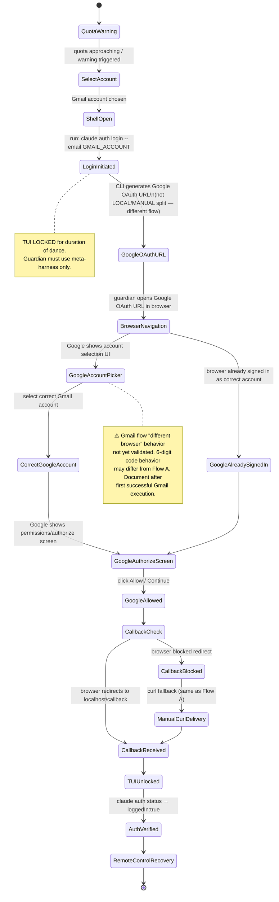

# claude-code-account-login

Canonical agent procedure for switching the `claude` CLI account. Platform-agnostic state machine. Reference implementation details (Linux/Firefox) are in the appendix — do not confuse the supernal method with an instantiated contingency.

Validated originally on: aurora@aurora (Kali Linux, Firefox ESR, tmux). Do not improvise.

---

## The key fact that makes everything else follow

`claude auth login` generates **two OAuth URLs simultaneously**:

| URL | redirect_uri | Name |
|-----|-------------|------|
| LOCAL | `http://localhost:PORT/callback` | Automatic flow |
| MANUAL | `https://platform.claude.com/oauth/code/callback` | Manual fallback |

The CLI prints: `If the browser didn't open, visit: [MANUAL URL]`

**The printed URL is the MANUAL URL. Do not use it.** Using it and then trying to deliver the code to the local server creates a redirect_uri mismatch → HTTP 400.

Use the LOCAL URL. The browser follows the redirect to localhost automatically.

---

## Critical: TUI lock requires meta-harness guardian

`claude auth login` **locks the entire TUI thread** while waiting for the OAuth callback. The dancing agent cannot use harness tools (ListAgents, SendMessage) during the dance. A guardian agent must assist through the **meta-harness** (wmux surface_list, terminal_read, terminal_send or equivalent). This is not optional — you cannot do the login dance alone.

---

## State Machine — Flow A: Non-Gmail (magic link accounts)

```mermaid
stateDiagram-v2
    [*] --> QuotaWarning

    QuotaWarning --> SelectAccount : quota approaching / warning triggered
    SelectAccount --> ShellOpen : non-Gmail account chosen

    ShellOpen --> LoginInitiated : run: claude auth login --email ACCOUNT
    note right of LoginInitiated
        TUI LOCKED for duration of dance.
        Guardian must use meta-harness only.
    end note

    LoginInitiated --> URLsGenerated : CLI outputs LOCAL + MANUAL URLs
    URLsGenerated --> LocalURLCaptured : guardian captures PORT\nreconstructs LOCAL URL from log

    LocalURLCaptured --> BrowserNavigation : guardian opens LOCAL URL in browser

    BrowserNavigation --> SameBrowserRedirect : same browser follows redirect automatically
    BrowserNavigation --> DiffBrowser6Digit : different browser intercepted the link

    DiffBrowser6Digit --> SixDigitDelivered : guardian reads 6-digit code\ndelivers to locked TUI via meta-harness
    SameBrowserRedirect --> OAuthPage
    SixDigitDelivered --> OAuthPage

    OAuthPage --> CorrectAccount : page footer shows correct email
    OAuthPage --> WrongAccount : page footer shows wrong email

    WrongAccount --> ArmEmailMonitor : click "Switch account"
    ArmEmailMonitor --> MagicLinkEmailSent : arm monitor BEFORE submitting email\nthen submit email address
    note right of ArmEmailMonitor
        Magic link expires in ~5 minutes.
        Arm monitor first, move fast.
    end note

    MagicLinkEmailSent --> MagicLinkSameBrowser : same browser opens magic link
    MagicLinkEmailSent --> MagicLinkDiffBrowser : different browser opened magic link

    MagicLinkSameBrowser --> OAuthPage : auth completes inline, page reloads
    MagicLinkDiffBrowser --> MagicLink6Digit : shows 6-digit code (not a redirect)
    MagicLink6Digit --> OAuthPage : guardian delivers code to locked TUI

    CorrectAccount --> Authorized : click Authorize

    Authorized --> CallbackCheck
    CallbackCheck --> CallbackReceived : browser redirects to localhost:PORT/callback
    CallbackCheck --> CallbackBlocked : browser stayed at platform.claude.com\nshowing auth code in URL bar

    CallbackBlocked --> ManualCurlDelivery : extract code+state from URL bar\ncurl http://[::1]:PORT/callback?code=CODE&state=STATE
    note right of ManualCurlDelivery
        CLI server listens on [::1] (IPv6 localhost).
        Use http://[::1]:PORT/ not http://127.0.0.1:PORT/
    end note
    ManualCurlDelivery --> CallbackReceived

    CallbackReceived --> TUIUnlocked : auth exchange completes
    TUIUnlocked --> AuthVerified : run: claude auth status\nconfirm loggedIn:true, correct email

    AuthVerified --> RemoteControlRecovery : all agents needing harness visibility\nrequire /remote-control refresh
    RemoteControlRecovery --> [*] : see SKILL-OF/claude-code-remote-control
```

**Note on the two kinds of codes:**
- **6-digit code** (States DiffBrowser6Digit / MagicLink6Digit): appears when a *different* browser opens an auth link mid-dance. Must be delivered to the dancing agent's locked TUI.
- **Final OAuth auth code** (State CallbackBlocked): appears in the URL bar of the browser after Authorize, when the `https → http` redirect is blocked. Delivered via curl to the local callback server directly.
These are distinct. Do not confuse them.

---

## State Machine — Flow B: Gmail (Google OAuth)



---

## Quota Sensing (when to initiate the dance)

Track before every dance:
1. **Current 5hr quota usage** (absolute)
2. **Current 7d quota usage** (absolute)
3. **1st derivative** — rate of usage increase
4. **2nd derivative** — is the rate accelerating?
5. **Dance cost** — time (minutes) and tokens consumed per dance, as rolling average

Decision rule: start the dance when `(quota_remaining / burn_rate) ≤ dance_time_with_margin`.

Initiate on quota warning. Do not wait for quota exhaustion — the dance takes 5–8 minutes and magic links expire in 5 minutes.

---

## Account Rotation

| Account | Email | Type | Flow |
|---------|-------|------|------|
| A | `dariensirius@protonmail.com` | Non-Gmail, claude.ai signup | Flow A |
| B | `claude.anthropic@aurora.wordgarden.dev` | Non-Gmail, claude.ai signup | Flow A |
| C | `ottopoet.thesean@gmail.com` | Gmail | Flow B |

Rotation: A → B → C → A. With ~3hr cycles, A's 5hr quota resets by the time you return to it.

---

## Appendix: Linux Reference Implementation (aurora@aurora, Kali, Firefox ESR, tmux)

The following are Linux-specific commands that instantiate the abstract steps above. They are NOT the skill — they are one machine's contingency.

### Open plain shell window
```bash
tmux new-window -t aurora -n "login-dance"
tmux list-panes -t aurora:login-dance -F "#{pane_current_command}"  # must show zsh
```

### Start login and capture port
Send to shell window (not via Claude Code Bash tool):
```bash
~/.local/bin/claude auth login --email YOUR@EMAIL 2>&1 | tee /tmp/auth-login.log
```
From agent Bash tool (after delay):
```bash
sleep 4
PORT=$(ss -tlnp | grep claude | grep -oP ':\K\d+' | head -1)
```

### Reconstruct LOCAL URL
```bash
MANUAL_URL=$(grep 'redirect_uri=https' /tmp/auth-login.log | grep -oP 'https://claude\.com[^\s]+')
LOCAL_URL="${MANUAL_URL/redirect_uri=https%3A%2F%2Fplatform.claude.com%2Foauth%2Fcode%2Fcallback/redirect_uri=http%3A%2F%2Flocalhost%3A${PORT}%2Fcallback}"
```

### Navigate Firefox to LOCAL URL (Linux/xdotool)
```bash
WID=$(xdotool search --class "firefox" 2>/dev/null | tail -1)
echo -n "$LOCAL_URL" | xclip -selection clipboard
xdotool windowactivate --sync $WID && sleep 0.5
xdotool key --window $WID ctrl+l && sleep 0.5
xdotool key --window $WID ctrl+v && sleep 0.3
xdotool key --window $WID Return
```

### Magic link extraction (Linux IMAP)
```bash
python3 ~/_/AS/email-agent/mail-watch.py --timeout-minutes 5 2>/dev/null
```
Then extract link from IMAP (see original README for full script).

### Machine-specific gotchas (aurora@aurora)
| Issue | Fix |
|-------|-----|
| Screenshots | `aurora-screenshot /tmp/out.png` (not import/gnome-screenshot — AVX2 SIGILL) |
| Firefox focus | `xdotool windowactivate` not `windowfocus` |
| tmux send-keys | `C-m` not `Enter` |
| IPv6 socket | `http://[::1]:PORT/` not `http://127.0.0.1:PORT/` |
| Multiple Firefox WIDs | `xdotool search --class "firefox" \| tail -1` |

### Time budget
Allow 5–8 minutes total. Magic link expires in 5 minutes — do not pause between arm-monitor → submit-email → paste-link.
