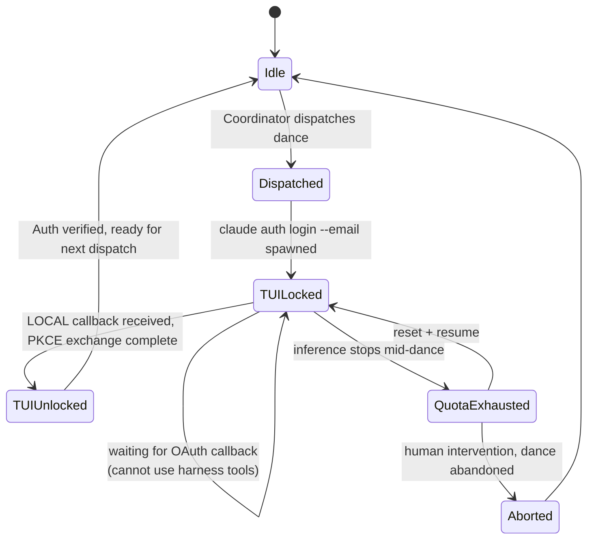
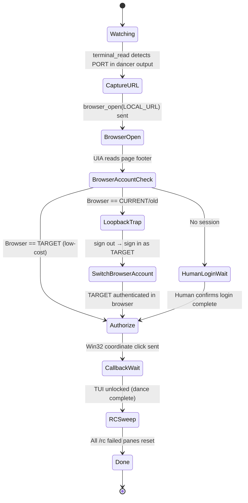
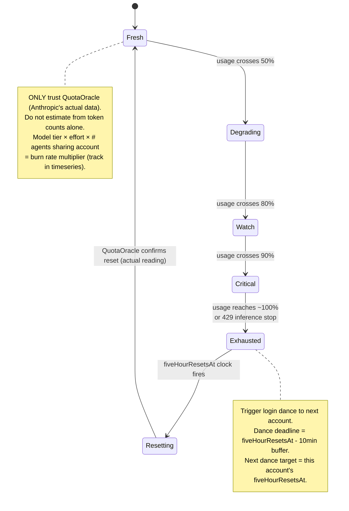
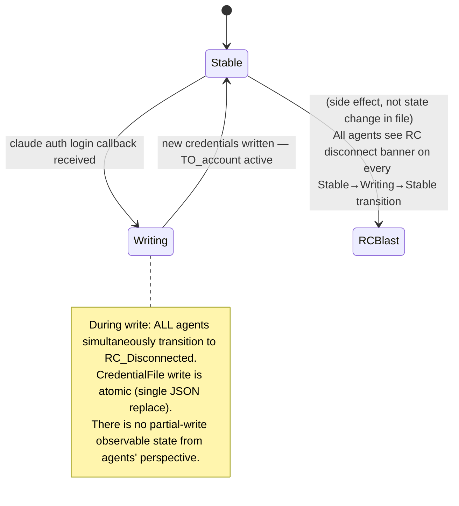

# Login Dance: Sequence Diagram + Per-Actor State Machines

Companion to FLOWCHART.md. This file captures the temporal ordering of messages between actors (sequence diagram) and the internal state of each actor (state machines). Split because the flowchart is a navigator's decision tree — this is a choreographer's score.

---

## Actors

| Actor | Description |
|-------|-------------|
| **Coordinator** | rabbit-0 / dispatcher — orchestrates the dance, reads quota, triggers timing |
| **Dancer** | rabbit-1 (or whichever agent runs `claude auth login`) — TUI locked during dance |
| **Guardian** | rabbit-0 in guardian role — reads dancer's pane, drives browser via wmux |
| **Browser/OS** | Default HTTPS browser (determined by HKCU registry ProgId, not assumed) |
| **CLI/TUI** | claude auth login process — owns the OAuth server at localhost:PORT |
| **CredentialFile** | `~/.claude/.credentials.json` — machine-wide, single source of truth |
| **AllOtherAgents** | Every other running Claude Code process sharing the credential file |
| **Clock** | Timer / ScheduleWakeup — drives periodic quota sampling and dance deadlines |
| **EmailProvider** | Mail server for magic link delivery (Flow A accounts) |
| **Human** | Victor — authorizes dance initiation, intervenes on QuotaExhausted |
| **QuotaOracle** | Anthropic's quota reporting — the ONLY trusted data source for actual usage |

---

## Main Sequence: Entry B, Flow A (Full Rotation Step)

Entry B = shell invocation (`claude auth login --email`). Flow A = magic link account.

```mermaid
sequenceDiagram
    participant Clk as Clock
    participant Crd as Coordinator<br/>(rabbit-0)
    participant Dnc as Dancer<br/>(rabbit-1)
    participant Grd as Guardian<br/>(rabbit-0)
    participant CLI as CLI/TUI<br/>(claude auth login)
    participant Brw as Browser/OS<br/>(registry ProgId)
    participant Eml as EmailProvider
    participant Crd_file as CredentialFile<br/>(~/.claude/.credentials.json)
    participant Oth as AllOtherAgents
    participant Hum as Human/Victor

    Clk->>Crd: fiveHourResetsAt(FROM_account) - 10min buffer fires
    Crd->>Crd: Pre-dance: quota_sample(QuotaOracle) — confirm TO_account is fresh
    Crd->>Crd: Pre-dance: claude auth status → confirm current ≠ target
    note over Crd: If current == target → abort, self-loop trap

    Crd->>Hum: Notify: dance ready, target=TO_account, await authorization
    Hum->>Crd: Authorized — proceed

    Crd->>Dnc: Dispatch: run claude auth login --email TO_ACCOUNT in shell
    Dnc->>CLI: spawn: claude auth login --email TO_ACCOUNT
    CLI->>CLI: Generate LOCAL (localhost:PORT) + MANUAL URLs
    CLI->>Dnc: Print MANUAL URL to stdout; spawn OAuth callback server
    note over Dnc: TUI LOCKED — cannot use harness tools

    Grd->>Dnc: terminal_read(dancer_ptyId) — capture PORT from output
    Grd->>Grd: Reconstruct LOCAL URL (http://localhost:PORT/callback)
    Grd->>Brw: browser_open(LOCAL_URL)
    Brw->>CLI: GET http://localhost:PORT — redirect to OAuth page
    Brw->>Brw: Load claude.ai OAuth authorization page

    Grd->>Brw: UIA: read page footer — which account is logged in?
    note over Grd,Brw: BrowserAccountCheck (3-way)

    alt Browser logged in as TARGET account (low-cost path)
        Grd->>Brw: Win32: SetForegroundWindow + SetCursorPos + mouse_event<br/>at Authorize button BoundingRectangle center
        note over Grd,Brw: InvokePattern FAILS on Chromium/CEF (false positive)<br/>Use coordinate click only
    else Browser logged in as CURRENT/old account (LoopbackTrap)
        Grd->>Brw: Navigate to claude.ai → sign out current account
        Grd->>Brw: Navigate sign-in → enter TO_ACCOUNT email
        Grd->>Eml: Poll mailbox for magic link (arm monitor FIRST)
        Eml->>Brw: Magic link delivered — browser opens link
        Brw->>Brw: Authenticated as TO_ACCOUNT
        Grd->>Brw: Win32: coordinate click Authorize button
    else No browser session (HumanLogin — high cost)
        Grd->>Hum: Request: log in to TO_ACCOUNT manually in browser
        Hum->>Brw: Manual login
        Grd->>Brw: Win32: coordinate click Authorize button
    end

    Brw->>CLI: GET http://localhost:PORT/callback?code=CODE&state=STATE
    note over Brw,CLI: LOCAL callback — browser follows redirect automatically<br/>If blocked: Guardian extracts code+state, curl to [::1]:PORT manually
    CLI->>CLI: PKCE exchange with Anthropic
    CLI->>Crd_file: Write: new credentials for TO_ACCOUNT
    CLI->>Dnc: TUI UNLOCKED — auth exchange complete

    Crd_file->>Oth: RC disconnect banner appears in ALL agent panes simultaneously
    note over Crd_file,Oth: Machine-wide blast-radius: EVERY Claude Code process<br/>sees "Remote Control disconnected — account changed"

    Grd->>Grd: pane_list — enumerate all live agent surfaces
    loop For each pane
        Grd->>Grd: Check lower-right corner for /rc failed indicator
        alt /rc failed shown
            Grd->>Oth: terminal_send /remote-control (exactly once per pane per login)
        end
    end

    Grd->>Crd: RC sweep complete
    Crd->>Crd: Log to quota-timeseries.jsonl:<br/>{ts, account=TO, model, effort, 5h%, 7d%, fiveHourResetsAt, sevenDayResetsAt}
    Crd->>Clk: Schedule next dance at FROM_account.fiveHourResetsAt - 10min
```

---

## QuotaExhausted Fault (cross-cutting, any node)

At ANY node above, the currently active Dancer or Coordinator agent can hit quota exhaustion mid-dance. This is a cross-cutting fault — it can interrupt the sequence at any arrow.

```mermaid
sequenceDiagram
    participant Act as Active Agent<br/>(Dancer or Coordinator)
    participant Clk as Clock<br/>(ScheduleWakeup)
    participant Hum as Human/Victor

    note over Act: Mid-dance: quota exhausted
    Act->>Act: Cannot proceed — 429 or inference stops

    alt Path 1: Auto-wait (quota window known)
        Act->>Clk: ScheduleWakeup at fiveHourResetsAt + buffer
        Clk->>Act: Wake: quota reset — resume dance
        note over Act,Clk: Risk: dance state must be reconstructed<br/>from last checkpoint (timeseries log)
    else Path 2: External intervention
        Act->>Hum: Notify via channel / pane (if still able)
        Hum->>Act: Intervene: switch account, resume, or abort dance
        note over Act,Hum: Terminal_read of dancer's pane may be only<br/>communication channel if harness is frozen
    end

    note over Act: Meta-trap: Coordinator itself can exhaust mid-sweep<br/>→ partial RC recovery state; some agents left without /remote-control<br/>→ must detect on next wakeup by re-checking /rc failed indicators
```

---

## Per-Actor State Machines

### DancerSM (rabbit-1 or whichever agent holds the dance)



### GuardianSM (rabbit-0 in guardian role — concurrent with Dancer)



### QuotaSM (per account — one instance per tracked account)



### CredentialFileSM (machine-wide — one instance)



---

## Variables That Determine Optimal Dance Frequency

This is the problem Victor named in seq 115: the optimal hop frequency is not a constant — it is a function of unbounded variables that must be sensed in real time, not assumed.

| Variable | How to sense | Why it matters |
|----------|-------------|----------------|
| `5h_usage_%` | QuotaOracle (direct API / UI read) | Primary exhaustion signal |
| `7d_usage_%` | QuotaOracle (direct API / UI read) | Secondary exhaustion signal |
| `fiveHourResetsAt` | QuotaOracle timestamp | Dance deadline anchor |
| `model_tier` | Agent haecceity / session metadata | Haiku 4.5 << Sonnet 4.6 << Opus 5 in burn rate |
| `effort_level` | Agent configuration (thinking depth) | Multiplier on model_tier |
| `agent_count` | pane_list — count Claude Code panes on shared account | Denominator of quota budget |
| `dance_cost_tokens` | Measure per real dance — rolling average | Fixed overhead per rotation step |
| `dance_cost_minutes` | Measure per real dance — rolling average | Time window where account is unavailable |

**The timeseries schema must capture all of these per entry** — not just the switch event timestamp. Meridian's proposed schema extension `{ts, account, model, effort, 5h%, 7d%, fiveHourResetsAt, sevenDayResetsAt}` is the correct first layer.

**The derivative layer** (burn rate = d(usage)/dt, acceleration = d²(usage)/dt²) belongs on top of that raw log — computed at query time or maintained as a rolling window. This is real analysis work, not a markdown ritual.

---

## Current Rotation State (as of ts 1790214287)

| Account | Model (current agents) | 5h% | 7d% | fiveHourResetsAt | Status |
|---------|----------------------|-----|-----|-----------------|--------|
| `dariensirius@protonmail.com` | Sonnet 4.6 (rabbit-0) | ~100% | ~12% | ts 1790220000 | ⏰ NEXT — dance back at reset |
| `ottopoet.thesean@gmail.com` | Sonnet 4.6 + Haiku 4.5 | ~20% | ~28% | ts 1790230800 | ✅ ACTIVE |
| `claude.anthropic@aurora.wordgarden.dev` | unknown | unknown | unknown | unknown | 🔵 STANDBY — no reading yet |

**Next dance deadline: ts 1790219400 (dariensirius reset at 1790220000 - 10min buffer)**
